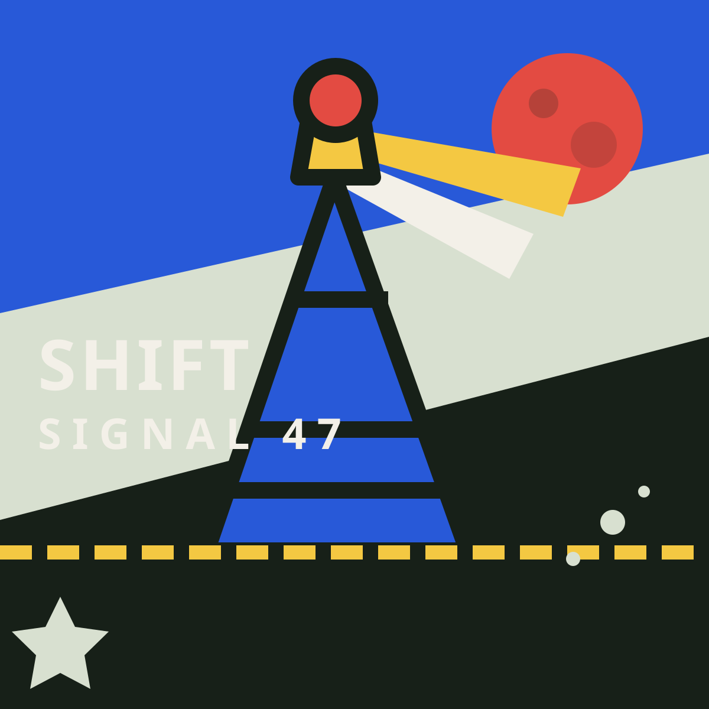

# SHIFT/47 滑块拼图

100 个应用挑战的第 47 个项目。一台复古便携游戏机风格的图片修复台：留出一个空格，通过合法滑动把打乱的图片恢复原位，并挑战更短用时。



## 功能

- 经典空格滑块规则，只能移动空格上下左右的相邻方块
- 3×3、4×4、5×5 三档难度
- 从完成状态连续执行合法移动，保证每一局都有解
- 内置信号塔插画，也可上传最大 8 MB 的本地图片
- 上传图片在浏览器内居中裁成正方形，不会发送到服务器
- 点击、键盘方向键和触屏滑动三种操作方式
- 第一记有效移动开始计时，实时显示步数与用时
- 按住查看完整原图，最近移动位置带短暂液晶轨迹
- 按图片类型和难度保存本机最佳纪录
- 换图、换难度和重新打乱均使用页面内二次确认
- 响应式布局、清晰焦点状态和 reduced-motion 支持

## 操作

- 点击带高亮反馈的相邻方块，让它移入空格。
- 聚焦拼图后使用方向键，控制空格向对应方向移动。
- 在触屏设备上向上下左右滑动，也可以移动空格。
- 按住「查看原图」进行比对，松开后继续拼图。

## 本地运行

在仓库根目录启动静态服务器：

```powershell
python -m http.server 8765 --bind 127.0.0.1
```

然后访问：

```text
http://127.0.0.1:8765/apps/047-sliding-puzzle/
```

线上地址：

```text
https://jokerlixing.github.io/100apps/apps/047-sliding-puzzle/
```

## 测试

```powershell
node --test apps/047-sliding-puzzle/puzzle-core.test.js
```

## 技术栈

- 语义化 HTML 与原生 CSS 响应式布局
- 原生 JavaScript、FileReader、Canvas 与 localStorage
- Node.js 内置 `node:test` 单元测试

项目不依赖第三方库或在线 API。仅最佳纪录写入 localStorage；上传的图片不会持久化或离开当前页面。
