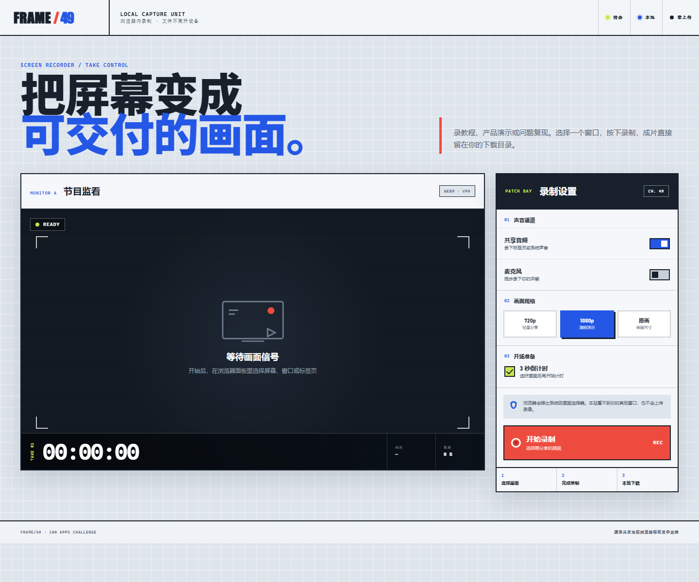

# FRAME/49 本地屏幕录制台

100 个应用挑战的第 49 个项目。一台完全运行在浏览器中的屏幕录制台：选择屏幕、窗口或标签页，按需混入共享音频和麦克风，录完即可在本地预览与下载。



## 功能

- 录制整个屏幕、单个窗口或浏览器标签页
- 按浏览器与共享目标能力采集系统/标签页音频
- 可选麦克风讲解，并在浏览器中混合双路声音
- 720p、1080p、原画三档画面规格
- 可关闭的 3 秒开场倒计时
- 实时监看、SMPTE 风格时间码与录制数据量
- 录制期间支持暂停、继续和主动结束
- 从浏览器原生共享面板结束时自动收尾录像
- 完成后直接预览、下载或开始下一段录制
- 自动选择 VP9、VP8、WebM 或 MP4 等浏览器支持的格式
- 选项偏好保存在本机，录像内容不会持久化或上传
- 桌面/移动端响应式布局、键盘焦点与 reduced-motion 支持

## 使用方式

1. 选择是否录制共享音频和麦克风，并设置画面规格。
2. 点击「开始录制」，在浏览器弹出的共享面板中选择目标画面。
3. 需要时暂停或继续；点击「结束并生成」，或从浏览器停止共享。
4. 在监看区回放结果，确认后点击「下载录像」。

## 隐私

FRAME/49 不包含后端，也不会发出录像上传请求。屏幕与声音只进入当前页面的 `MediaStream`，录制分片只保存在当前标签页内存中；关闭页面、刷新或开始下一段录像时，临时播放地址会被释放。

## 本地运行

屏幕捕获需要安全上下文。GitHub Pages 的 HTTPS 可直接使用，本地开发请通过 `localhost` 或 `127.0.0.1` 启动静态服务器：

```powershell
python -m http.server 8049 --bind 127.0.0.1
```

然后访问：

```text
http://127.0.0.1:8049/apps/049-screen-recorder/
```

线上地址：

```text
https://jokerlixing.github.io/100apps/apps/049-screen-recorder/
```

## 浏览器兼容与限制

- 推荐最新版 Chrome 或 Edge；Firefox/Safari 的共享音频、编码格式和可选共享目标能力可能不同。
- 是否能录到系统声音由浏览器、操作系统以及用户选择的共享目标共同决定。例如部分环境只允许录制标签页声音。
- 浏览器会显示系统级共享面板，页面不能替用户预选窗口或绕过授权。
- 长时间、高分辨率录制会占用较多内存；本项目定位于教程、演示和问题复现等短录制。

## 测试

在仓库根目录执行：

```powershell
node --test apps/049-screen-recorder/recorder-core.test.js
node --check apps/049-screen-recorder/recorder-core.js
node --check apps/049-screen-recorder/app.js
```

## 技术栈

- 语义化 HTML 与原生 CSS 响应式布局
- 原生 JavaScript、Screen Capture API、MediaStream 与 MediaRecorder
- Web Audio API 双路声音混合
- Blob、Object URL 与本地下载
- Node.js 内置 `node:test` 单元测试

项目不依赖第三方库或在线 API。
