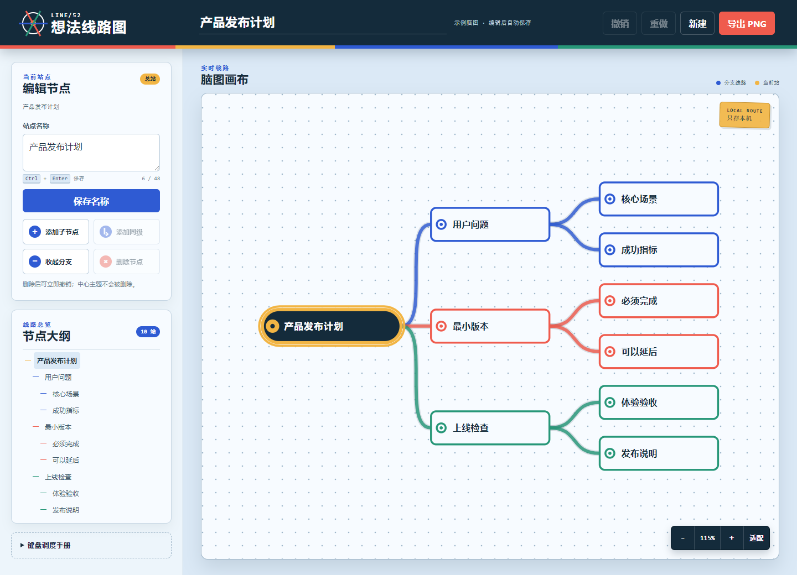

# LINE/52 · 在线脑图编辑器

LINE/52 是一款本地优先的 SVG 脑图编辑器。它把想法画成地铁线路：中心主题是换乘总站，一级分支拥有独立线路色，每个子主题是一座可编辑、可折叠的站点。



## 功能

- 添加子节点与同级节点，随时改名或删除
- 展开、收起任意有子节点的分支，并显示隐藏节点数
- 撤销与重做最多保留 50 步，删除内容也可恢复
- 空白处拖动画布，滚轮或按钮缩放，一键适配全部内容
- 自动保存到当前浏览器，刷新后恢复上次脑图
- 导出完整可见脑图为高清 PNG，不受当前视口影响
- 节点大纲、键盘焦点、状态播报和 390px 手机布局

## 快捷键

| 快捷键 | 操作 |
| --- | --- |
| `Enter` | 编辑当前节点名称 |
| `Tab` | 为当前节点添加子节点 |
| `Space` | 展开或收起当前分支 |
| `Delete` / `Backspace` | 删除当前节点 |
| `Ctrl/Cmd + Enter` | 在名称输入框中保存 |
| `Ctrl/Cmd + Z` | 撤销 |
| `Ctrl/Cmd + Shift + Z` | 重做 |

## 本地运行

从仓库根目录启动一个静态服务器，例如：

```bash
python -m http.server 8000
```

然后访问：

```text
http://127.0.0.1:8000/apps/052-mind-map-editor/
```

## 数据与隐私

应用不需要账号，也不会上传脑图。文档以 `line52-document-v1` 为键保存在浏览器 `localStorage`；清理站点数据会同时删除本地脑图。若存档损坏或版本不兼容，页面会恢复示例并明确提示。

PNG 导出完全在浏览器内完成。首版不包含云同步、多人协作、附件、自由连线和 JSON 导入导出。

## 测试

```bash
node --test apps/052-mind-map-editor/mind-core.test.js
node --check apps/052-mind-map-editor/mind-core.js
node --check apps/052-mind-map-editor/app.js
```

核心测试覆盖文本边界、不可变增删改、重复 ID、根节点保护、父节点查询、折叠可见性、树布局和存档校验。

## 文件

- `index.html`：调度台、节点编辑器、SVG 画布与导出入口
- `styles.css`：地铁线路视觉、响应式布局和可访问状态
- `mind-core.js`：可独立测试的树模型与布局算法
- `app.js`：历史记录、localStorage、SVG 交互和 PNG 导出

