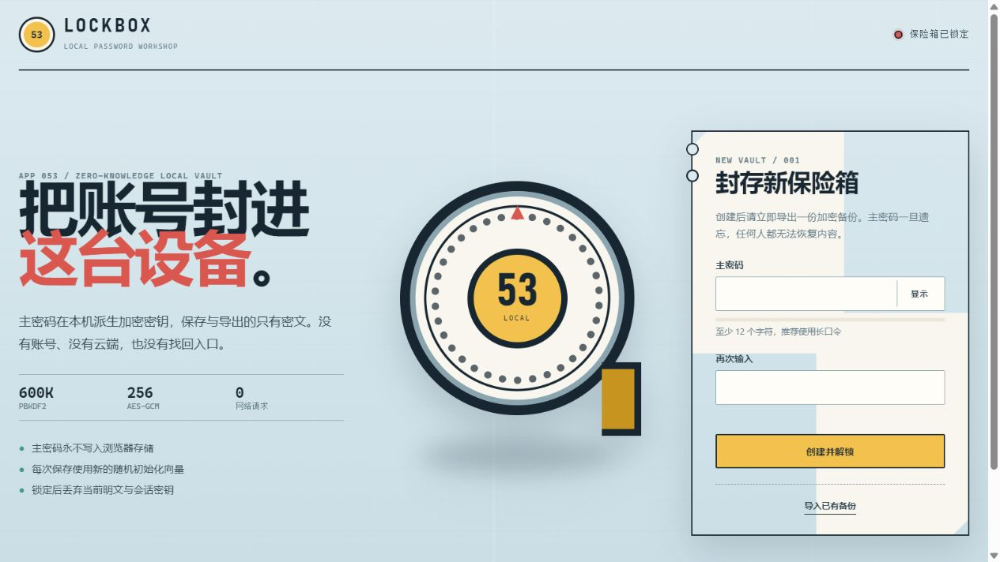

# LOCKBOX/53 · 本地密码管理器

LOCKBOX/53 是一座运行在浏览器里的离线账号保险箱：用主密码解锁，账号记录只以认证密文保存在当前浏览器，并可导出加密 JSON 备份。页面没有账号系统、云同步、第三方脚本或外部网络请求。



## 功能

- 创建主密码保险箱，刷新后用同一主密码重新解锁
- 新建、编辑、删除和搜索账号记录
- 保存标题、用户名、密码、网址与备注，密码默认遮挡
- 使用安全随机源生成 12–64 位密码，可配置字符组与易混淆字符
- 复制用户名、账号密码或生成结果，并明确提示剪贴板历史风险
- 默认 5 分钟无操作自动锁定，可选 1、5、15、30 分钟
- 导出加密 JSON 备份；导入前先验证格式和主密码，再替换本机密文
- 桌面、平板和手机响应式布局，支持键盘焦点与减少动态效果

## 加密方案

- 使用 Web Crypto API，不自行实现密码学原语
- PBKDF2-HMAC-SHA-256，600,000 次迭代，16 字节随机盐
- 派生不可导出的 256 位 AES-GCM 密钥
- 每次保存使用新的 12 字节随机 IV，并认证保险箱版本标记
- `localStorage` 和导出文件只包含版本、KDF 参数、盐、IV、更新时间与密文
- 主密码不会写入存储；主密码遗忘后无法找回保险箱内容

参数选择参考 [OWASP Password Storage Cheat Sheet](https://cheatsheetseries.owasp.org/cheatsheets/Password_Storage_Cheat_Sheet.html)；浏览器实现使用 [MDN Web Crypto `deriveKey()`](https://developer.mozilla.org/en-US/docs/Web/API/SubtleCrypto/deriveKey) 与 [AES-GCM](https://developer.mozilla.org/en-US/docs/Web/API/SubtleCrypto/encrypt)。

## 安全边界

这个项目用于学习浏览器本地加密，能保护静态存储或备份文件被直接读取，但不能抵御已经控制页面脚本、恶意浏览器扩展、已入侵操作系统、键盘记录器、屏幕录制或剪贴板历史的攻击。锁定会丢弃应用持有的明文状态和 `CryptoKey` 引用，但 JavaScript 无法保证立即擦除浏览器引擎内部的所有内存副本。

账号网址只接受 `http:` 与 `https:`，页面使用 CSP 禁止第三方脚本和网络连接。不要把它当作经过独立安全审计的商业密码管理器。

## 本地运行

Web Crypto 需要安全上下文。请从仓库根目录用 localhost 启动静态服务器：

```bash
python -m http.server 8000 --bind 127.0.0.1
```

然后访问：

```text
http://127.0.0.1:8000/apps/053-password-vault/
```

线上版本部署在 GitHub Pages：

```text
https://jokerlixing.github.io/100apps/apps/053-password-vault/
```

## 测试

```bash
node --test apps/053-password-vault/vault-core.test.js
node --check apps/053-password-vault/vault-core.js
node --check apps/053-password-vault/app.js
```

核心测试覆盖字段与容量边界、主密码规则、密码强度、安全网址、Base64、信封参数、加解密往返、错误主密码、密文篡改、随机 IV 和密码生成器。

浏览器验证覆盖首次创建、错误密码、刷新重开、账号 CRUD、搜索、生成、复制、手动锁定、危险操作保护，以及 1280px 和 390px 响应式布局。

## 文件

- `index.html`：语义结构、CSP 与锁定/解锁界面
- `styles.css`：LOCKBOX/53 锁匠工作台视觉与响应式布局
- `vault-core.js`：可独立测试的校验、加密与密码生成核心
- `vault-core.test.js`：Node 内置测试套件
- `app.js`：DOM 交互、加密存储、自动锁定与备份流程
- `assets/screenshot.jpg`：GitHub Pages 线上首屏实拍

