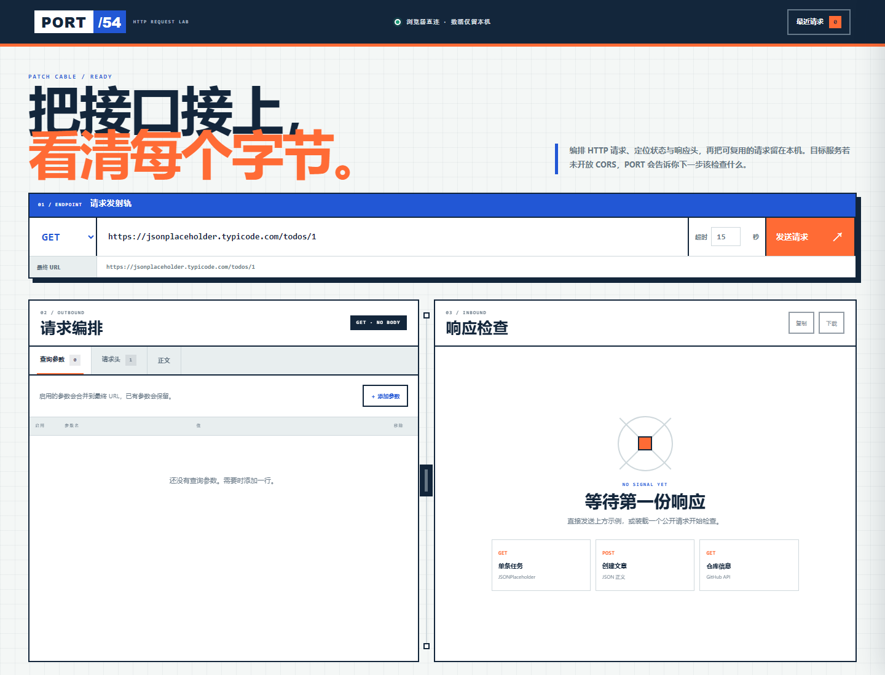

# PORT/54 · API 测试工作台

一个直接运行在浏览器中的本地优先 API 调试台。它可以编排 HTTP 请求、解释响应状态与 CORS/网络错误、复制或下载响应，并把最近请求安全地留在当前浏览器中。



## 功能

- 支持 GET、POST、PUT、PATCH、DELETE、HEAD
- 查询参数与请求头可逐行增删、启用和停用
- 支持 JSON、纯文本正文；JSON 发送前校验并可一键格式化
- 3–60 秒超时控制，以及手动停止请求
- 展示状态码、耗时、字节大小、响应头和请求快照
- JSON 响应自动美化；HTML 只按文本显示，不执行远程内容
- 当前响应视图可复制，原始响应可下载
- 保存最近 12 条请求配置，刷新后仍可恢复
- 三个公开示例：JSONPlaceholder GET/POST 与 GitHub 仓库接口
- 响应式桌面/移动布局、键盘页签导航、减少动态效果支持

## CORS 与浏览器限制

PORT/54 使用浏览器原生 `fetch` 直接访问目标地址，因此必须遵守目标服务的 CORS 策略。出现 `CORS` 状态通常表示目标接口没有允许当前网页来源，浏览器不会把响应内容交给页面。

可行的处理方式：

1. 在你控制的 API 上配置允许的 `Origin`、方法与请求头。
2. 使用你控制的服务端代理发送请求。
3. 检查 HTTPS 页面是否请求了被浏览器阻止的 HTTP 地址。

本工具不会尝试绕过浏览器安全策略，也不会声称网络/CORS 错误是有效服务器响应。

## 隐私

- 请求配置只保存在当前浏览器的 `localStorage`。
- Authorization、Cookie、Proxy-Authorization、X-API-Key 和常见 token/secret 请求头在历史记录中会被遮罩。
- 恢复历史时，已遮罩的秘密值保持为空且停用，需要手动重新输入。
- 响应正文不写入历史记录。
- 所有远程正文使用 `textContent` 显示，不会执行响应中的 HTML 或脚本。

## 本地运行

从仓库根目录启动静态服务器：

```bash
python -m http.server 8000
```

访问：

```text
http://127.0.0.1:8000/apps/054-api-tester/
```

不建议直接用 `file://` 打开；部分目标服务会拒绝来源为 `null` 的跨域请求。

## 测试

```bash
node --test apps/054-api-tester/api-core.test.js
node --check apps/054-api-tester/api-core.js
node --check apps/054-api-tester/app.js
```

核心测试覆盖 URL/协议校验、查询参数合并、请求头清洗、敏感字段遮罩、正文准备、响应类型识别、字节格式化与历史数量上限。

浏览器验证覆盖 1440px 桌面与 390px 移动布局、真实公开 GET 请求、参数合并、响应显示、非法 JSON 拦截、历史抽屉、无横向溢出和控制台错误。

## 文件

- `index.html`：语义结构、请求/响应工作台与历史抽屉
- `styles.css`：PORT/54 网络分析仪视觉与响应式布局
- `api-core.js`：可独立测试的请求领域逻辑
- `api-core.test.js`：Node 内置测试运行器用例
- `app.js`：浏览器状态、Fetch/AbortController、历史、复制与下载
- `preview.png`：桌面界面预览
