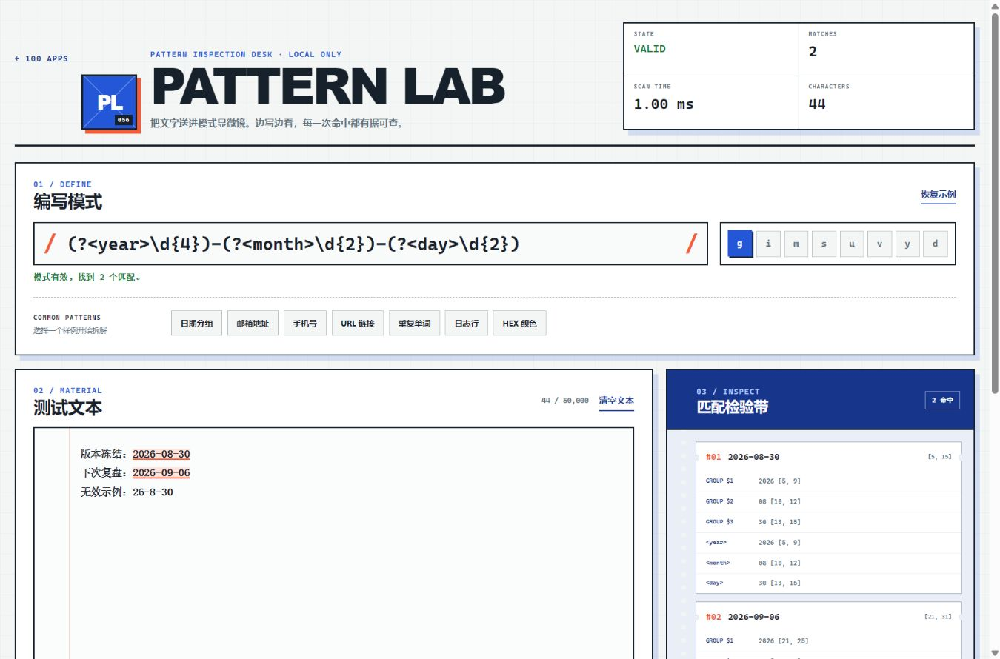

# Pattern Lab / 056 · 正则表达式测试器

Pattern Lab 是一款纯前端的 JavaScript 正则表达式检验台。输入表达式和测试文本后，它会实时高亮每个匹配，并展示索引范围、编号/命名捕获组与替换结果。整个检验过程留在当前浏览器，不会发起网络请求。



## 功能

- 实时编译 JavaScript 正则，支持 `d g i m s u v y` 标志
- 镜像高亮层与原生文本框同步输入、换行和滚动
- 匹配检验带展示完整值、范围、编号捕获组和命名捕获组
- 点击检验带可定位并选中原文中对应的匹配
- 内置日期、邮箱、手机号、URL、重复单词、日志行和 HEX 颜色示例
- 实时替换预览，支持 `$&` / `$1` / `$<name>` 并可一键复制
- 语法错误、无匹配、空表达式和结果过多均有独立状态
- 自动恢复上次编辑内容，桌面与移动端响应式布局

## 使用

1. 在“编写模式”中输入不含两侧 `/` 的表达式。
2. 选择需要的标志，然后在“测试文本”中输入或粘贴样本。
3. 点击右侧任意匹配查看对应位置和捕获组。
4. 如果要调试替换，在页面底部输入替换字符串。

`Ctrl/Cmd + Enter` 可立即重新检验。未开启 `g` 时，页面按 JavaScript 原生语义只显示第一个匹配。

## 边界说明

- 测试文本最多 50,000 个字符，检验带最多展示 300 个匹配。
- `v` 等新标志会根据当前浏览器能力自动启用或禁用。
- 某些灾难性回溯表达式仍可能占用较长计算时间，不要直接测试不可信来源的复杂表达式。

## 本地运行

从仓库根目录启动任意静态服务器，例如：

```bash
python -m http.server 8000
```

然后访问：

```text
http://127.0.0.1:8000/apps/056-regex-tester/
```

## 测试

```bash
node --test apps/056-regex-tester/regex-core.test.js
node --check apps/056-regex-tester/regex-core.js
node --check apps/056-regex-tester/app.js
```

单元测试覆盖标志规范化、编译错误、全局/单次匹配、零长度匹配、命名捕获、结果上限、高亮分段和替换标记。

## 技术栈与文件

- HTML5 / CSS3 / Vanilla JavaScript
- Node.js 内置 `node:test`
- `index.html`：语义结构与无障碍标签
- `styles.css`：Pattern Lab 实验台视觉、匹配检验带和响应式布局
- `regex-core.js`：可独立测试的正则领域逻辑
- `app.js`：页面状态、实时检验、联动和本地持久化

