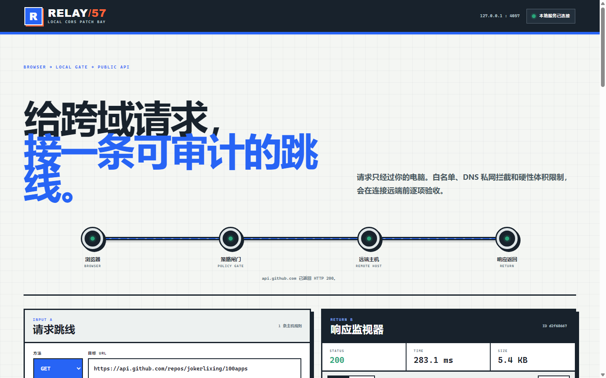
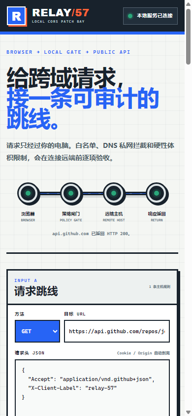

# RELAY/57 · 本地 CORS 代理

一个默认只监听本机的受限 CORS 代理与请求调试台。它让前端开发请求跨过浏览器的同源限制，同时用主机白名单、DNS 私网拦截、逐跳复查和体积限制守住代理边界。





## 功能

- 支持 GET、POST、PUT、PATCH、DELETE、HEAD 和 CORS OPTIONS 预检
- 精确主机与 `*.example.com` 子域白名单
- 同时拦截 URL 中的私网 IP 和 DNS 解析出的环回、私网、链路本地、文档及保留地址
- 301、302、303、307、308 跳转逐跳重新校验，跨主机跳转不携带 Authorization
- 请求体、响应体、超时和跳转次数均有硬限制
- 自动剥离 Cookie、Origin、Referer、转发链和逐跳头；不接受上游 `Set-Cookie`
- 调试台显示响应状态、耗时、体积、响应头和正文，并可复制对应的 fetch 示例
- 最近一次请求草稿仅保存在当前浏览器，不记录请求正文或认证信息到服务日志
- 桌面与移动端响应式布局，支持键盘焦点和减少动态效果

## 快速开始

需要 Node.js 18 或更高版本，不需要安装依赖。

```bash
cd apps/057-cors-proxy
node server.js
```

打开：

```text
http://127.0.0.1:4057
```

默认只允许 `api.github.com`。在 PowerShell 中加入其他主机：

```powershell
$env:PROXY_ALLOWED_HOSTS='api.github.com,*.example.com'
node server.js
```

macOS / Linux：

```bash
PROXY_ALLOWED_HOSTS='api.github.com,*.example.com' node server.js
```

## 在代码中使用

```js
const target = "https://api.github.com/repos/jokerlixing/100apps";
const response = await fetch(
  "http://127.0.0.1:4057/proxy?url=" + encodeURIComponent(target),
  { headers: { Accept: "application/vnd.github+json" } },
);
const data = await response.json();
```

健康检查和公开配置：

```text
GET http://127.0.0.1:4057/health
GET http://127.0.0.1:4057/config
```

## 配置

| 环境变量 | 默认值 | 范围 / 说明 |
| --- | --- | --- |
| `HOST` | `127.0.0.1` | 监听地址；改成 `0.0.0.0` 前先理解局域网暴露风险 |
| `PORT` | `4057` | 1–65535 |
| `PROXY_ALLOWED_HOSTS` | `api.github.com` | 逗号分隔；支持精确主机、`*.example.com` 和显式的 `*` |
| `PROXY_TIMEOUT_MS` | `10000` | 250–60000 ms |
| `PROXY_MAX_REQUEST_BYTES` | `1048576` | 1 KB–10 MB |
| `PROXY_MAX_RESPONSE_BYTES` | `5242880` | 1 KB–50 MB |
| `PROXY_MAX_REDIRECTS` | `3` | 0–10 次 |

`*` 只会放开公网主机匹配，不会关闭私网/IP 安全检查。若 DNS 同时返回公网和私网地址，请求会整体拒绝。

## 安全边界

这是本地开发工具，不是公网开放中继。默认绑定 `127.0.0.1`；如果改成 `0.0.0.0`、配置宽泛通配符或转发 Authorization，调用者需要自行控制网络访问与凭证范围。服务不提供 Cookie 会话代理，不绕过目标站点的认证、授权、限流或使用条款。

GitHub Pages 只能展示静态界面，不能运行 Node 代理。完整功能必须在本机启动 `server.js`。

## 测试

从仓库根目录运行：

```bash
npm test --prefix apps/057-cors-proxy
node --check apps/057-cors-proxy/proxy-policy.js
node --check apps/057-cors-proxy/proxy-client.js
node --check apps/057-cors-proxy/server.js
node --check apps/057-cors-proxy/app.js
```

自动测试覆盖白名单、IPv4/IPv6 私网判断、混合 DNS 结果、头部过滤、正文转发、相对跳转、超时、响应上限、健康检查、CORS 预检、禁止方法和错误包络。

## 文件

- `proxy-policy.js`：目标、DNS、IP 与头部安全策略
- `proxy-client.js`：锁定解析地址的 HTTP/HTTPS 转发和受限跳转
- `server.js`：静态界面、健康检查、配置和代理路由
- `index.html` / `styles.css` / `app.js`：配线架请求调试台
- `*.test.js`：Node 单元与集成测试
