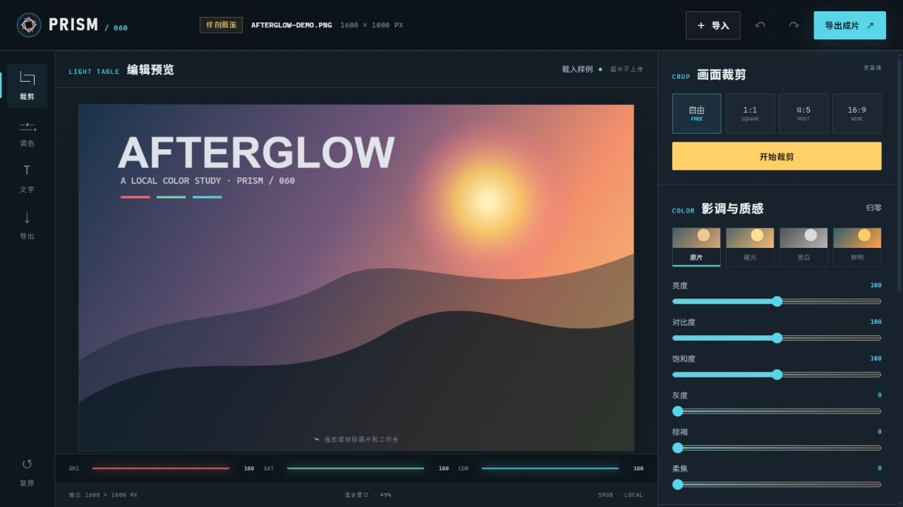

# PRISM/60 · 在线图片编辑器

一个完全在浏览器本地运行的快速图片工作台：导入图片，完成裁剪、调色和加字，再导出 PNG、JPEG 或 WebP。



## 功能

- 文件选择、拖放或粘贴 PNG、JPEG、WebP 图片
- 自由、1:1、4:5、16:9 裁剪，支持移动和四角缩放裁剪框
- 原片、暖光、黑白、鲜明预设，以及六项影调细调
- 单层文字内容、字号、颜色、横向和纵向位置控制
- 最多 30 步撤销/重做，一键复原全部编辑
- 按 50%、75% 或原尺寸导出 PNG、JPEG、WebP
- 20 MB 文件上限与 4000 万像素安全上限
- 桌面和移动端响应式工作台，支持键盘焦点与减少动态效果偏好

## 隐私边界

导入、预览和导出都通过浏览器 Canvas 在当前设备完成。应用不上传图片、不保存文件、不请求账号或远程 API；刷新页面后编辑状态会清空。

## 使用方式

1. 点击“导入”，或把图片拖放/粘贴到画布；也可以直接使用内置样例。
2. 选择裁剪比例，移动或拉动裁剪框，然后应用裁剪。
3. 选择滤镜预设或细调参数，按需添加一层文字。
4. 选择格式、质量与导出尺寸，点击“下载图片”。

快捷键：

- `Ctrl/⌘ + Z`：撤销
- `Ctrl/⌘ + Shift + Z` 或 `Ctrl/⌘ + Y`：重做

## 本地运行

```bash
python -m http.server 8000
```

打开 `http://localhost:8000/apps/060-image-editor/`。

线上地址：[GitHub Pages](https://jokerlixing.github.io/100apps/apps/060-image-editor/)

## 验证

```bash
node --test apps/060-image-editor/editor-core.test.js
node --check apps/060-image-editor/editor-core.js
node --check apps/060-image-editor/app.js
```

浏览器验收覆盖样例载入、1:1 裁剪、滤镜、文字、撤销/重做、JPEG 导出，以及 390 px 移动端布局。
