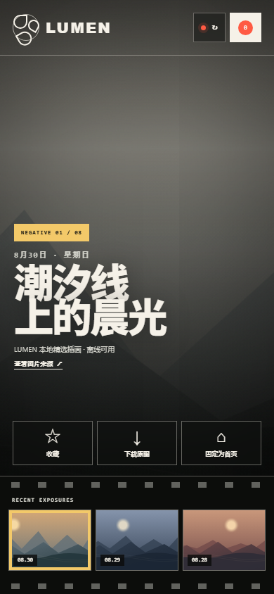

# LUMEN/61 · 每日壁纸

100 个应用挑战的第 61 个项目。一张会随 Bing 每日图片更新的浏览器首页：在八格胶片上回看最近风景，收藏喜欢的画面，并把任意一张固定为下次打开时的首页背景。



## 功能

- 获取最近八天的 Bing 每日图片、日期、标题与版权信息
- 接口部分失败时用本地画面补齐八格；全部失败时明确进入“精选兜底”
- 上次成功的图片元数据保存在本机，网络波动时优先继续展示
- 胶片日期带、左右方向键和移动端横向滑动切换
- `F` 快捷收藏，收藏夹支持快速返回任意画面
- 把当前画面固定为 LUMEN 首页背景，再点一次即可取消
- 下载原图；若图片源不允许跨域下载，则在新标签打开并提示手动保存
- 复制线上地址，配合浏览器设置把 LUMEN 作为启动首页
- 390px 手机到宽屏桌面响应式布局、可见键盘焦点与 reduced-motion 支持

## 数据、隐私与版权

页面通过开源的 Bing Wallpaper API 适配服务读取 Bing 每日图片，不需要账号或 API Key。网络请求按天独立结算，单张失败不会阻塞其余画面；URL 加上 `?offline=1` 可在不请求接口的情况下验收本地降级路径。

收藏 ID、固定背景 ID 和最近成功的元数据只保存在当前浏览器的 `localStorage`。应用没有后端，不上传收藏、浏览记录或图片文件。

Bing 图片的著作权归对应摄影师和版权方所有，页面会显示来源提供的完整署名与链接。下载功能只应用于个人壁纸使用；仓库截图采用 LUMEN 自带的本地矢量画面。

## “固定为首页”的边界

网页不能绕过浏览器安全设置，直接替用户修改启动首页。LUMEN 的“固定为首页”会先固定应用内的默认画面，并给出可复制的线上地址；用户仍需在 Chrome、Edge、Firefox 或 Safari 设置中自行粘贴该地址。网页也不能直接修改操作系统桌面壁纸，下载后需由用户在系统中设置。

## 本地运行

从仓库根目录启动静态服务器：

```powershell
python -m http.server 4173 --bind 127.0.0.1
```

访问：

```text
http://127.0.0.1:4173/apps/061-daily-wallpaper/
```

强制本地精选模式：

```text
http://127.0.0.1:4173/apps/061-daily-wallpaper/?offline=1
```

## 测试

在仓库根目录执行：

```powershell
node --test apps/061-daily-wallpaper/wallpaper-core.test.js
node --check apps/061-daily-wallpaper/app.js
node apps/061-daily-wallpaper/qa/browser-smoke.mjs
```

核心测试覆盖数据清洗、HTTPS URL 约束、日期、排序去重、缓存合并、收藏、首页状态和下载文件名。浏览器冒烟测试使用本机 Chrome/Edge DevTools 协议，自动验证在线与离线路径、八日胶片、收藏、键盘切换、首页弹窗、localStorage、1440px 桌面、390px 手机、横向溢出与运行时错误。

## 技术栈

- 语义化 HTML、原生 CSS 与原生 JavaScript
- Fetch API、localStorage、Clipboard API、Blob 下载
- 零运行时依赖的 UMD 核心模块
- Node.js 内置 `node:test` 与 Chrome DevTools Protocol 冒烟测试
