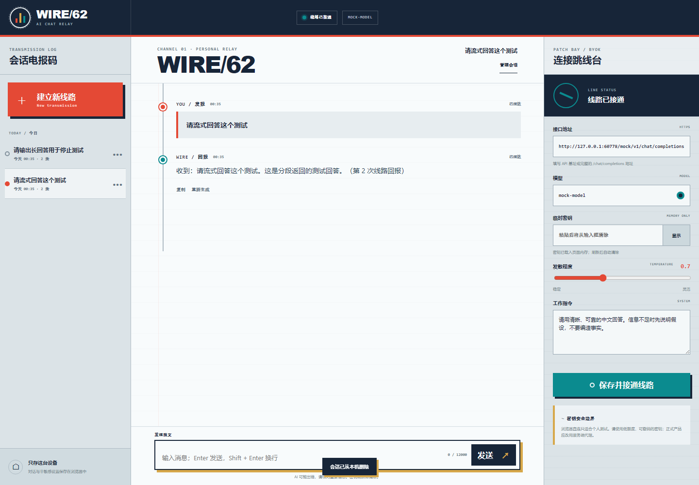

# WIRE/62 · AI 聊天通讯台

100 个应用挑战的第 62 个项目。一个部署在静态页面上的本地优先 BYOK 聊天助手：连接用户自己的 OpenAI Chat Completions 兼容接口，把回答作为 SSE 报文逐段显示，并在当前浏览器保存多个会话。



## 功能

- 配置兼容 OpenAI 的 API 基址、模型、系统指令和 temperature
- 使用 Server-Sent Events 逐块显示模型回复
- 生成中随时停止，已收到的内容不会丢失
- 复制回答、重新生成最后一条回答
- 新建、切换、重命名和删除本地会话
- 刷新后恢复对话与非敏感连接设置
- 接口、鉴权、限流、CORS、空响应和畸形流错误提示
- 1440px 桌面三栏与 390px 手机双抽屉布局
- 键盘可见焦点、live region 和 reduced-motion 支持

## 连接兼容接口

打开右侧“连接跳线台”，依次填写：

1. API 基址，例如 `https://api.openai.com/v1`；也可以填写完整的 `/chat/completions` 地址
2. 该服务实际支持的模型名称
3. 临时 API 密钥
4. 可选的工作指令与发散程度

页面只调用兼容的 `POST /chat/completions`，请求体包含 `model`、`messages`、`temperature` 和 `stream: true`。服务端必须允许当前页面来源执行跨域请求；若浏览器提示 CORS 错误，需要使用支持浏览器跨域的兼容服务或自己部署服务端代理。

## 密钥安全边界

OpenAI 的[官方 API 文档](https://developers.openai.com/api/reference/overview#authentication)明确要求不要在浏览器或应用客户端暴露 API 密钥，正式应用应从服务端环境变量或密钥管理服务加载凭据。

WIRE/62 是个人学习与本地测试工具，因此采取以下限制：

- 仓库和部署页面不包含任何密钥
- 用户提交后，密钥会立即从输入框清空
- 密钥只保留在当前页面的 JavaScript 内存中
- 不写入 localStorage、IndexedDB、URL、日志或会话记录
- 刷新或关闭页面即清除

浏览器页面在发请求时仍然必须临时接触密钥，因此这不等同于服务端保密。请只使用低额度、权限受限、可随时撤销的个人测试密钥，不要在共享设备或不可信浏览器扩展环境中使用。正式上线给其他用户时，应把 API 调用迁移到受控服务端。

## 本地数据

接口地址、模型、系统指令、temperature 和对话记录保存在当前浏览器的 `localStorage`。数据不会自动同步或上传到 WIRE/62 自己的服务器；发送消息时，当前上下文会按配置提交到用户选择的模型服务商。删除浏览器站点数据即可移除全部本地记录。

## 键盘操作

- `Enter`：发送消息
- `Shift + Enter`：换行
- `Esc`：关闭移动端会话或设置抽屉
- `Tab` / `Shift + Tab`：在控件之间移动

## 本地运行

在仓库根目录启动静态服务器：

```powershell
python -m http.server 4173 --bind 127.0.0.1
```

访问：

```text
http://127.0.0.1:4173/apps/062-ai-chat/
```

## 测试

在仓库根目录执行：

```powershell
node --test apps/062-ai-chat/chat-core.test.js
node --check apps/062-ai-chat/app.js
node apps/062-ai-chat/qa/browser-smoke.mjs
node --test qa/tracker.test.js
```

核心测试覆盖接口安全校验、会话清洗、标题、上下文、请求体、SSE 任意分块与增量文本。浏览器冒烟测试会启动本机 mock Chat Completions 流服务和临时 Chrome/Edge，不需要真实 API 密钥；它会验证逐块显示、重试、停止、复制、多会话、刷新恢复、密钥不落盘、桌面/手机布局与运行时错误。

## 技术栈

- 语义化 HTML、原生 CSS 与原生 JavaScript
- Fetch API、ReadableStream、TextDecoder、AbortController
- localStorage 与无依赖 UMD 核心模块
- Node.js 内置 `node:test`、HTTP mock 与 Chrome DevTools Protocol
