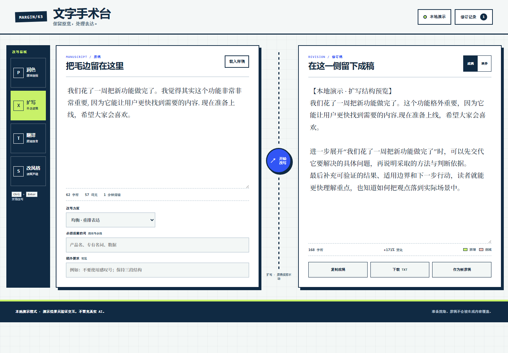

# MARGIN/63 · AI 文字手术台

100 个应用挑战的第 63 个项目。它不是聊天窗口，而是一张保留原稿的改稿桌：选择润色、扩写、翻译或风格改写，控制改写力度和保留词，在另一侧接收流式修订稿，再查看新增、删减和字数变化。



## 功能

- 润色、扩写、翻译、风格改写四种模式
- 保守、均衡、大胆三档改写力度
- 目标语言、目标风格、必须保留词与额外要求
- 原稿和修订稿并列，不用生成内容覆盖用户输入
- 流式显示、随时停止，并保留已产生的文字
- 成稿/逐词差异双视图，标记新增与删减
- 字符、词元、阅读时间和变化比例统计
- 复制成稿、下载 TXT、把结果作为新原稿继续加工
- 最近八次修订保存在当前浏览器，支持恢复、删除和清空
- 1440px 桌面到 390px 手机响应式布局、可见键盘焦点与 reduced-motion 支持

## 两种生成方式

### 本地演示

首次打开默认使用本地演示，不需要网络或密钥。它用确定性规则模拟流式生成，并始终在结果首行显示“本地演示”。这个模式用于体验四种工具、差异、历史和导出流程，不会把规则文本冒充真实 AI，也不承诺通用翻译质量。

### 真实 AI 接口

在右上角“本地演示”中切换到真实接口，填写一个 OpenAI-compatible Chat Completions 地址和模型名。应用会发送：

```json
{
  "model": "your-writing-model",
  "messages": [
    { "role": "system", "content": "编辑规则" },
    { "role": "user", "content": "任务、约束与原稿" }
  ],
  "stream": true,
  "temperature": 0.55
}
```

流式响应支持 SSE `choices[0].delta.content`；普通 JSON 支持 `choices[0].message.content`、`output_text` 和常见嵌套输出文本。自建网关需要允许当前网页来源跨域访问。

## 密钥与隐私边界

- API Key 只保存在当前页面的 JavaScript 内存，刷新或关闭页面后清除。
- `localStorage` 只保存生成方式、接口地址、模型名和最近八次非敏感修订；不写入 API Key。
- 页面没有应用后端，也没有第三方脚本。真实模式会从浏览器直接请求用户填写的接口。
- 共享设备上不要填写生产密钥。优先使用限额、限来源、可撤销的个人网关凭证。
- 修订历史可能含原稿正文；处理敏感文本后请打开“修订记录”并清空本机记录。

## 本地运行

从仓库根目录启动静态服务器：

```powershell
python -m http.server 4263 --bind 127.0.0.1
```

访问：

```text
http://127.0.0.1:4263/apps/063-ai-writer/
```

## 测试

在仓库根目录执行：

```powershell
node --test apps/063-ai-writer/writer-core.test.js
node --check apps/063-ai-writer/writer-core.js
node --check apps/063-ai-writer/app.js
node apps/063-ai-writer/qa/browser-smoke.mjs http://127.0.0.1:4263/apps/063-ai-writer/ apps/063-ai-writer/assets
node --test qa/tracker.test.js
```

核心测试覆盖中英混排统计、四类提示词、接口地址约束、碎片化 SSE、五种响应形状、本地演示和差异算法。浏览器测试使用本机 Chrome/Edge DevTools 协议，自动验证生成、停止边界、差异、历史、刷新清除密钥、1440px 桌面、390px 手机、44px 点击目标、横向溢出和运行时错误。

## 技术栈

- 语义化 HTML、原生 CSS 与原生 JavaScript
- Fetch API、ReadableStream、AbortController、localStorage、Clipboard API、Blob 下载
- 零运行时依赖的 UMD 核心模块
- Node.js 内置 `node:test` 与 Chrome DevTools Protocol 冒烟测试
