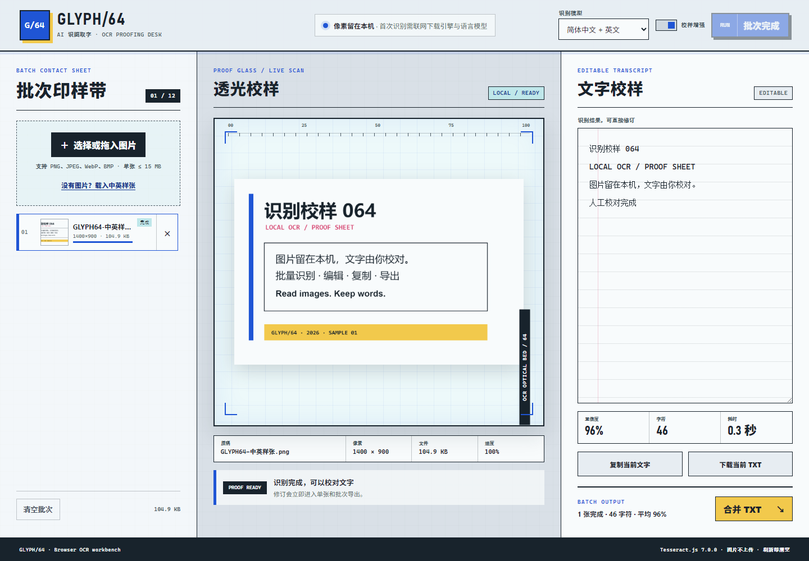

# GLYPH/64 · AI 识图取字

GLYPH/64 是一个浏览器内的批量 OCR 校样台：加入最多 12 张截图、票据或扫描件，选择中英文模型，顺序识别后直接修订、复制或导出 TXT。图片像素不会上传到业务服务器，刷新页面后图片和文字都会清空。



## 核心功能

- 文件选择、拖放和剪贴板粘贴 PNG、JPEG、WebP、BMP 图片。
- 单批最多 12 张，单张最多 15 MB、3600 万像素；无图片时可载入内置中英样张。
- 简体中文 + 英文、繁体中文 + 英文、仅英文三组模型。
- 可选校样增强：在不修改原图的前提下缩放、铺白底、灰度化并提高对比度。
- 单 Worker 顺序队列，显示模型下载与逐张识别的真实进度；支持中止并保留已完成结果。
- 逐张编辑、复制、下载 TXT，以及按队列顺序生成合并 TXT。
- 显示识别置信度、非空白字符数和耗时；单张失败不会清空其他校样。

## 使用方式

1. 选择、拖入或粘贴图片，也可以点击“载入中英样张”。
2. 选择识别模型；低对比度扫描件建议保留“校样增强”。
3. 点击“开始批次”。首次运行会下载 OCR 引擎和所选语言模型，耗时取决于网络。
4. 在右侧校对识别文字，然后复制、下载单张 TXT 或导出合并 TXT。
5. 中止后，当前项会回到等待状态；再次点击“继续批次”只处理未完成项。

## 隐私、网络与限制

- 图片解码、Canvas 预处理和 OCR 都在当前浏览器中完成，应用不会把图片上传到自建服务器。
- 首次识别会从 jsDelivr 和语言模型源下载 Tesseract.js 运行时、WebAssembly 核心与训练数据；这些依赖可能被浏览器缓存。因此“本地识别”不等于首次完全离线。
- 页面不使用 localStorage、IndexedDB 或账号保存图片和识别结果；刷新即清空。Tesseract.js 自身可能用浏览器缓存保存语言资源。
- OCR 不能保证完全准确。复杂表格、手写字、弯曲文字、低分辨率或严重倾斜的图片需要人工校对。
- 当前不支持 PDF、表格结构还原、翻译、云端历史和永久项目保存。

## 技术栈与第三方组件

- 语义化 HTML、响应式 CSS、原生 JavaScript、Canvas 2D。
- [Tesseract.js 7.0.0](https://github.com/naptha/tesseract.js/)（Apache-2.0），通过固定版本 CDN 动态加载。
- 无构建步骤；可直接部署到 GitHub Pages。
- 核心规则采用 UMD 模块，使用 Node.js 内置测试运行器验证。

Tesseract.js 官方建议多图任务复用同一个 Worker；GLYPH/64 采用单 Worker 顺序队列，优先控制浏览器内存、移动端稳定性和中止行为，而不是并行占满设备。

## 本地运行与验证

在仓库根目录执行：

```bash
python -m http.server 4173 --bind 127.0.0.1
```

打开 `http://127.0.0.1:4173/apps/064-ai-ocr/`。自动检查：

```bash
node --test apps/064-ai-ocr/ocr-core.test.js
node --check apps/064-ai-ocr/ocr-core.js
node --check apps/064-ai-ocr/app.js
node --test qa/tracker.test.js
node apps/064-ai-ocr/qa/browser-smoke.mjs
```

浏览器烟测会注入确定性的假 Worker，以验证队列、进度、编辑、导出状态、中止和响应式布局；它不把模拟文本当作真实 OCR 准确率证明。真实模型集成遵循 Tesseract.js 7.0.0 的 `createWorker` / `recognize` / `terminate` API。

## 在线地址

[https://jokerlixing.github.io/100apps/apps/064-ai-ocr/](https://jokerlixing.github.io/100apps/apps/064-ai-ocr/)
