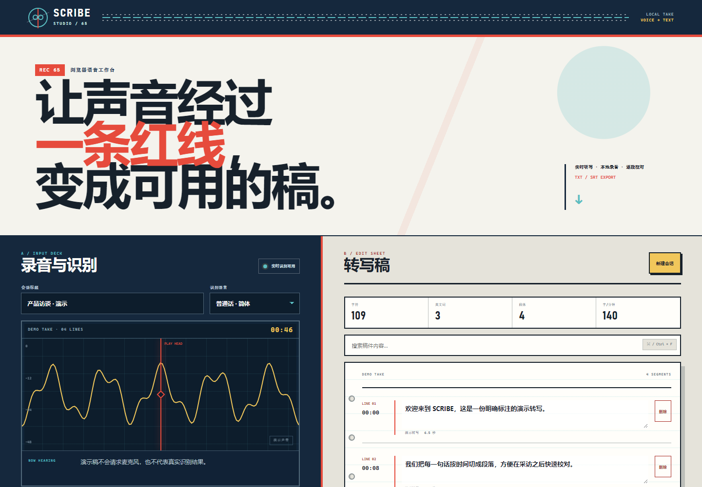

# SCRIBE/65 · AI 语音转文字

100 个应用挑战的第 65 个项目。一台在浏览器中工作的语音转写台：允许麦克风后实时生成带时间的段落，同时保留本次本地录音；听写结束后可以逐段校对、搜索、复制全文，并导出 TXT 或 SRT 字幕。



## 功能

- 使用浏览器 `SpeechRecognition` / `webkitSpeechRecognition` 实时识别普通话、繁体中文、英语、日语与韩语
- 同一次麦克风授权同时驱动实时识别和 `MediaRecorder` 本地录音
- 暂停、继续与结束听写；服务正常结束时自动续接识别
- 正在识别的临时文本、最终时间段和实时声带反馈
- 每段直接编辑、删除，按关键词搜索并统计字符、英文词、段落与字速
- 复制带时间的全文，下载 TXT，生成标准 SRT 时间码
- 本地音频导入回放，方便边听边人工校对
- 无麦克风或不支持识别时可载入明确标注的演示稿
- 稿件刷新恢复、新建会话二次确认、390px 手机到宽屏桌面响应式布局
- 可见键盘焦点、读屏状态通知与 `prefers-reduced-motion` 支持

## 隐私与浏览器边界

最终转写段、标题、语言和更新时间保存在当前浏览器的 `localStorage`。录音 Blob 只存在当前页面内存中，不写入 localStorage；刷新或离开页面后无法恢复，重要录音应先点击“下载录音”。导入音频也只创建本地对象 URL，不会由本应用上传。

浏览器原生语音识别可能把音频交给浏览器厂商的在线识别服务，具体取决于浏览器、操作系统和语言包。请不要在不了解所属组织隐私要求时录入敏感会议、医疗、财务或客户内容。

`SpeechRecognition` 不能可靠地把 `<audio>` 文件直接当作识别输入，因此“选择音频”只提供本地回放和人工校对，不伪装成文件自动转写。首版没有要求用户在前端填写第三方 API Key，也没有云端历史或说话人识别。

## 浏览器支持

- 推荐：桌面版 Chrome 或 Edge，使用 HTTPS 或 `localhost`
- 麦克风需要用户主动授权；无权限时已经识别的段落仍会保留
- Safari、Firefox 或企业策略禁用 Web Speech API 时，可使用演示稿体验编辑与导出
- 音频录制格式由浏览器决定，通常为 WebM/Opus；少数浏览器仅能转写而不能生成录音文件

## 使用方法

1. 选择识别语言，填写会话标题。
2. 点击“开始听写”并允许麦克风；说话时临时结果先经过红色播放头。
3. 使用“暂停/继续”保留同一录音，或点击“结束”生成本地回放。
4. 在右侧逐段校对文字，搜索或删除不需要的内容。
5. 复制全文、下载 TXT，或导出带时间码的 SRT。

快捷键：焦点不在输入框时，`Ctrl/⌘ + Enter` 开始或结束听写，`Ctrl/⌘ + F` 聚焦稿件搜索。

## 本地运行

麦克风 API 需要安全上下文；`localhost` 被浏览器视为安全上下文。从仓库根目录启动静态服务器：

```powershell
python -m http.server 4173 --bind 127.0.0.1
```

访问：

```text
http://127.0.0.1:4173/apps/065-ai-transcriber/
```

直接载入演示稿：

```text
http://127.0.0.1:4173/apps/065-ai-transcriber/?demo=1
```

## 测试

在仓库根目录执行：

```powershell
node --test apps/065-ai-transcriber/transcript-core.test.js
node --check apps/065-ai-transcriber/transcript-core.js
node --check apps/065-ai-transcriber/app.js
node apps/065-ai-transcriber/qa/browser-smoke.mjs
```

核心测试覆盖数据清洗、段落排序与去重、编辑/删除、指标、损坏存储恢复、TXT/SRT 和安全文件名。浏览器冒烟测试使用本机 Chrome/Edge DevTools 协议，自动验证演示稿、编辑、搜索、删除、localStorage 恢复、新建清空、1440px 桌面、390px 手机、无横向溢出以及运行时错误。

真实麦克风仍需人工验收：确认权限提示、实时临时结果、最终段落、暂停/继续、结束后回放与录音下载在目标浏览器可用。

## 技术栈

- 语义化 HTML、原生 CSS 与原生 JavaScript
- Web Speech API、MediaRecorder API、Web Audio API、localStorage、Blob 下载
- 零运行时依赖的 UMD 核心模块
- Node.js 内置 `node:test` 与 Chrome DevTools Protocol 冒烟测试
