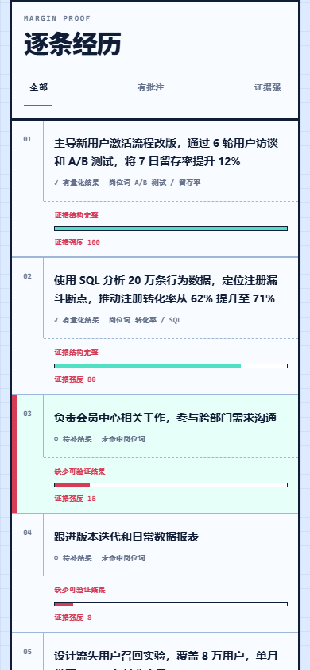

# PROOF/66 · AI 简历证据编辑台

100 个应用挑战的第 66 个项目。把简历与目标岗位放在同一张“校样台”上，本地检查岗位关键词、量化成果、弱表达和结构完整度，再把批注落实为可复制、可替换的逐条改写。



## 功能

- 粘贴简历与岗位说明，或读取 UTF-8 的 `.txt` / `.md` 简历文件
- 本地识别工作、项目、技能、教育与简介等结构
- 提取目标岗位关键词，区分“已覆盖”和“待核对”
- 对每条经历检查动作、岗位语言、量化结果、长度和弱职责词
- 给出岗位匹配、成果证据、表达清晰和结构完整四项可解释分数
- 按“全部 / 有批注 / 证据强”筛选经历，逐条查看编辑边注
- 生成不编造数字的本地改写模板，并可替换回原简历重新分析
- 下载包含分数、关键词、批注与模板的 UTF-8 文本报告
- 可选接入 OpenAI 兼容 Chat Completions 接口，只精修当前选中的一条经历
- 390px 手机到宽屏桌面的响应式布局、键盘操作、可见焦点与 reduced-motion 支持

## 隐私与 AI 边界

默认分析完全在浏览器本地完成，不需要账号或 API Key，不会把简历上传到 PROOF/66 的服务器；项目本身没有后端。简历与岗位正文默认不写入 `localStorage`，刷新页面即消失。

只有用户主动配置 AI 接口并点击“用我的接口精修这一条”时，浏览器才会把以下内容发给用户填写的接口：当前选中的经历、目标岗位文本、已覆盖与待核对关键词。接口地址、模型和 API Key 只保存在当前页面的 JavaScript 内存中，刷新即清除，不写入本地存储。

PROOF/66 要求模型保留信息缺口并使用 `【待补充】`，但生成内容仍可能出错。应用不会替用户确认事实；任何数字、职责、技术或结果在应用到简历前都必须人工核对。

## 分数意味着什么

“编辑就绪度”只用于决定先改哪里，不模拟具体招聘平台的 ATS，也不预测面试或录用结果。岗位关键词匹配是文本覆盖检查：缺词不代表缺能力，只有在事实成立时才应补写；分数高也不代表内容真实或适合所有岗位。

## 文件支持

首版支持直接粘贴文本以及 512 KB 以内的 UTF-8 TXT / Markdown 文件。PDF、DOCX 的字体嵌入、分栏和扫描件会带来不稳定的静态站解析，因此首版明确要求用户先复制正文，不伪装成“已解析”不完整内容。

## 配置可选 AI

1. 点击页头“AI 接口设置”或经历旁的 AI 精修按钮。
2. 填写兼容 OpenAI Chat Completions 的 HTTPS 地址、模型名称和 API Key。
3. 选择一条经历并请求精修。
4. 核对草稿中的每个事实，再复制或替换回简历。

浏览器会直接请求用户指定的服务，因此该服务必须允许当前页面的 CORS 来源。远程接口必须使用 HTTPS；本地开发允许 `localhost` 和 `127.0.0.1` 的 HTTP 地址。

## 本地运行

从仓库根目录启动静态服务器：

```powershell
python -m http.server 4173 --bind 127.0.0.1
```

访问：

```text
http://127.0.0.1:4173/apps/066-resume-optimizer/
```

## 测试

在仓库根目录执行：

```powershell
node --test apps/066-resume-optimizer/resume-core.test.js
node --check apps/066-resume-optimizer/resume-core.js
node --check apps/066-resume-optimizer/app.js
node --test qa/tracker.test.js
node apps/066-resume-optimizer/qa/browser-smoke.mjs
```

核心测试覆盖文本规范化、关键词排序去重、结构与经历识别、量化证据、弱表达、评分边界、安全接口地址、AI 请求范围和本地改写不编造指标。浏览器冒烟测试使用本机 Chrome/Edge DevTools 协议，自动验证示例分析、筛选与选择、设置弹窗、改写替换、报告下载、密钥不落盘、1440px 桌面、390px 手机、横向溢出和运行时错误。

## 技术栈

- 语义化 HTML、原生 CSS 与原生 JavaScript
- 零运行时依赖的 UMD 分析核心
- Fetch API、File API、Clipboard API、Blob 下载与原生 Dialog
- Node.js 内置 `node:test` 与 Chrome DevTools Protocol 冒烟测试
