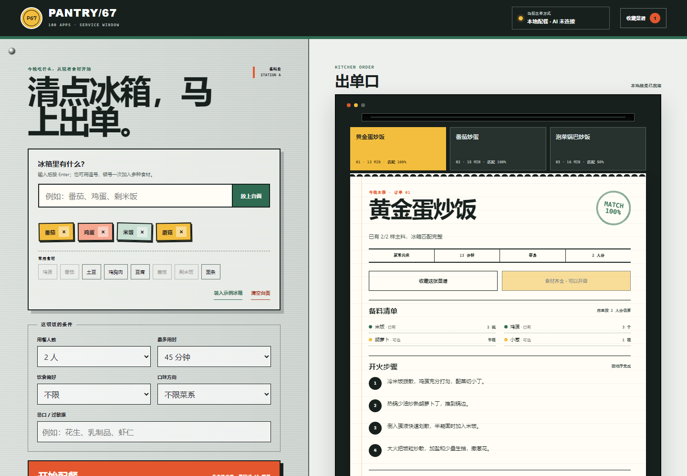

# PANTRY/67 · AI 菜谱推荐

100 个应用挑战的第 67 个项目。把冰箱里的现有食材放上“不锈钢备餐台”，PANTRY 会先在本机生成三份可执行菜谱，再在服务器已配置时尝试 AI 增强；选定菜谱后可以核对已有与缺少食材、按人数换算用量、收藏，并把缺料夹进采购清单。



## 功能

- 中文逗号、顿号、换行和 Enter 批量录入食材，自动合并常见别名
- 18 道内置菜谱按食材覆盖率、用时、饮食偏好和菜系稳定排序
- 蛋奶素、纯素、高蛋白、低碳水、最长用时与忌口/过敏原约束
- 无严格时间结果时只放宽烹饪时长，绝不自动放宽饮食或忌口条件
- 三张候选厨房订单、推荐原因、已有/待补食材、人数用量换算和步骤
- 缺料一键加入采购夹，支持勾选、删除与复制纯文本清单
- 菜谱收藏、采购夹、最近食材和设置均保存在当前浏览器
- 可选服务端 AI 增强；任何超时、未配置或异常响应都保留本地结果
- 1440px 桌面到 390px 手机响应式布局、可见焦点与 reduced-motion 支持

## 两种运行方式

### 1. 静态本地推荐（无需密钥）

从仓库根目录启动任意静态服务器：

```powershell
python -m http.server 4173 --bind 127.0.0.1
```

访问：

```text
http://127.0.0.1:4173/apps/067-ai-recipe/
```

GitHub Pages 发布版本也采用此模式。页面会立即给出完整本地结果；对 `/api/recommend` 的增强请求不可用时，不影响食材、菜谱、采购或收藏流程。URL 加 `?offline=1` 可跳过增强请求并明确验收离线路径。

### 2. 服务端 AI 增强

PANTRY 的 Node 服务使用 OpenAI-compatible Chat Completions 请求格式。模型名不硬编码，避免替用户选择成本或已经变化的模型。至少设置以下环境变量：

```powershell
$env:AI_API_KEY="your-server-side-key"
$env:AI_MODEL="your-model-name"
node apps/067-ai-recipe/server.js
```

默认端点是 `https://api.openai.com/v1`。兼容服务可另设：

```powershell
$env:AI_BASE_URL="https://your-provider.example/v1"
$env:PORT="4173"
node apps/067-ai-recipe/server.js
```

访问 `http://127.0.0.1:4173/`。密钥只由 `server.js` 从环境变量读取，不会写入 HTML、localStorage、日志或浏览器响应。接口限制 32 KiB 请求体和 12 秒上游等待，并会再次清洗 AI 菜谱的标题、数组长度、数值与 HTML。

## 隐私与安全边界

- 静态模式不上传食材、忌口、收藏或采购清单。
- AI 模式只在点击“开始配餐”后，把当前食材与约束发送到你配置的服务提供商；其数据处理政策由该提供商决定。
- 浏览器只保存本地交互状态，不保存 API Key。
- 忌口过滤采用保守的菜谱标签匹配，但不能识别商品交叉污染。严重过敏请核对包装、餐具与烹饪环境。
- 热量和三大营养素是按菜谱估算的每份数据，不构成医疗或营养治疗建议。
- AI 结果不可信时会被丢弃，界面继续显示本地菜谱；生成内容仍应由烹饪者检查熟度与食品安全。

## 测试

从仓库根目录执行：

```powershell
node --test apps/067-ai-recipe/recipe-core.test.js apps/067-ai-recipe/server.test.js qa/tracker.test.js
node --check apps/067-ai-recipe/recipe-core.js
node --check apps/067-ai-recipe/app.js
node --check apps/067-ai-recipe/server.js
node apps/067-ai-recipe/qa/browser-smoke.mjs
```

核心测试覆盖食材别名、批量解析、去重、饮食/忌口/用时约束、排名、受控放宽和不可信 AI 数据。服务测试覆盖静态白名单、路径穿越、请求体限制、未配置状态、成功代理与上游错误隔离。浏览器冒烟测试自动启动本地服务与临时 Chrome/Edge，验证桌面和手机布局、三张订单、采购夹、收藏持久化、强制离线与运行时错误。

## 技术栈

- 语义化 HTML、原生 CSS、原生 JavaScript
- 零依赖 UMD 推荐核心与 18 道本地菜谱目录
- Node.js 内置 HTTP、Fetch、文件 API 与服务端 AI 代理
- localStorage、Clipboard API、原生 `<dialog>`
- Node.js `node:test` 与 Chrome DevTools Protocol 浏览器验收

## 快捷说明

- 食材输入框中按 `Enter`：加入当前食材
- 菜谱订单：点击切换完整票据
- 收藏菜谱：保存在本机收藏夹
- 缺料加入采购夹：只加入当前票据明确缺少的主料
