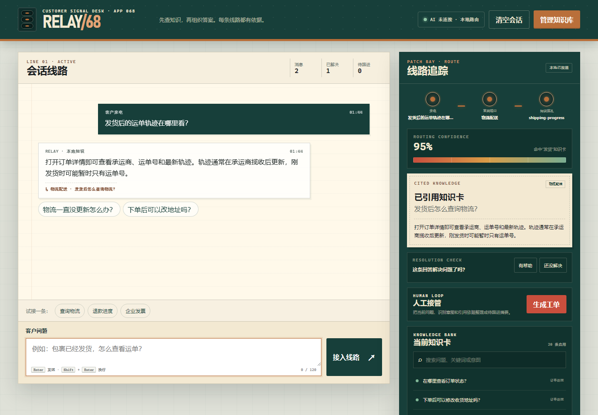

# RELAY/68 · 智能客服机器人

100 个应用挑战的第 68 个项目。RELAY 是一张“可追线”的客服工作台：客户提出问题后，它先识别订单、物流、退换货、退款、支付等意图，再从当前启用的 FAQ 知识库中找到依据并回答；界面会把“来电 → 意图端口 → 知识插孔”的线路完整展示出来。找不到可靠依据时，RELAY 不猜测真实订单状态，而是生成一份人工待跟进摘要。



## 功能

- 19 条中文电商 FAQ，覆盖订单、物流、退换货、退款、支付、发票、账户、商品、优惠和人工服务
- 本地中英文意图识别、FAQ 加权检索、稳定排序、路由置信度和回答依据
- 可视化三段线路：客户问题、识别意图、引用知识卡
- FAQ 搜索、启停、编辑、新增和自定义卡片删除，修改结果保存在当前浏览器
- 常用问题、建议追问、会话清空、回答“有帮助/没解决”反馈
- 低置信度问题明确转人工，并生成可复制的最近会话与路由摘要
- 静态模式完整可用；服务端配置后可用 AI 在已引用知识卡范围内整理措辞
- 1440px 桌面与 390px 手机布局、键盘发送、可见焦点、状态播报和 reduced-motion 支持

## 两种运行方式

### 1. 静态本地路由（无需密钥）

从仓库根目录启动任意静态服务器：

```powershell
python -m http.server 4173 --bind 127.0.0.1
```

访问：

```text
http://127.0.0.1:4173/apps/068-customer-support/
```

GitHub Pages 发布版本也采用此模式。FAQ、路由、会话、反馈和人工摘要都能本地运行；URL 加 `?offline=1` 可明确跳过 AI 增强请求。

### 2. 服务端 AI 增强

Node 服务使用 OpenAI-compatible Chat Completions 请求格式。至少设置：

```powershell
$env:AI_API_KEY="your-server-side-key"
$env:AI_MODEL="your-model-name"
node apps/068-customer-support/server.js
```

默认端点是 `https://api.openai.com/v1`。兼容服务可另设：

```powershell
$env:AI_BASE_URL="https://your-provider.example/v1"
$env:PORT="4173"
node apps/068-customer-support/server.js
```

访问 `http://127.0.0.1:4173/`。浏览器会先显示本地可信答案，再请求 AI 整理；服务端只接受 64 KiB 内的请求、最多 40 张启用知识卡和最近 8 条会话。AI 回复必须引用请求内真实存在的知识卡，否则会被丢弃并继续显示本地答案。

## 隐私与业务边界

- 静态模式不会上传会话、知识卡、反馈或工单摘要。
- AI 模式会把当前问题、最近会话和启用知识卡发送给你配置的提供商；其数据处理政策由该提供商决定。
- API Key 只由 `server.js` 从环境变量读取，不会写入 HTML、localStorage、日志或浏览器响应。
- RELAY 不连接真实订单、支付、退款或物流系统，所有状态提示都要求用户以授权系统和订单详情为准。
- 不要把密码、验证码、完整支付信息、身份证号或完整地址写入 FAQ、对话或工单摘要。
- 本项目是客服路由与知识库演示，不替代商家的正式售后政策、工单系统或人工审核。

## 键盘操作

- 输入框中按 `Enter`：发送问题
- 按 `Shift + Enter`：输入换行
- `Tab`：依次访问快捷问题、反馈、工单和知识库操作
- 原生知识库对话框支持 `Esc` 关闭

## 测试

从仓库根目录执行：

```powershell
node --test apps/068-customer-support/support-core.test.js apps/068-customer-support/server.test.js qa/tracker.test.js
node --check apps/068-customer-support/support-core.js
node --check apps/068-customer-support/app.js
node --check apps/068-customer-support/server.js
node apps/068-customer-support/qa/browser-smoke.mjs
```

核心测试覆盖文本清洗、意图分类、FAQ 排名、停用卡片、低置信度、恶意字段和 AI 引用校验。服务测试覆盖静态白名单、请求体限制、无密钥状态、成功代理、未知引用和上游错误隔离。浏览器验收覆盖物流回答、回答依据、反馈、自定义知识卡、持久化、人工接管、桌面/手机溢出和运行时异常。

## 技术栈

- 语义化 HTML、原生 CSS、原生 JavaScript
- 零依赖 UMD 意图/FAQ 路由核心
- Node.js 内置 HTTP、Fetch、文件 API 与服务端 AI 代理
- localStorage、Clipboard API、原生 `<dialog>`
- Node.js `node:test` 与 Chrome DevTools Protocol 浏览器验收
