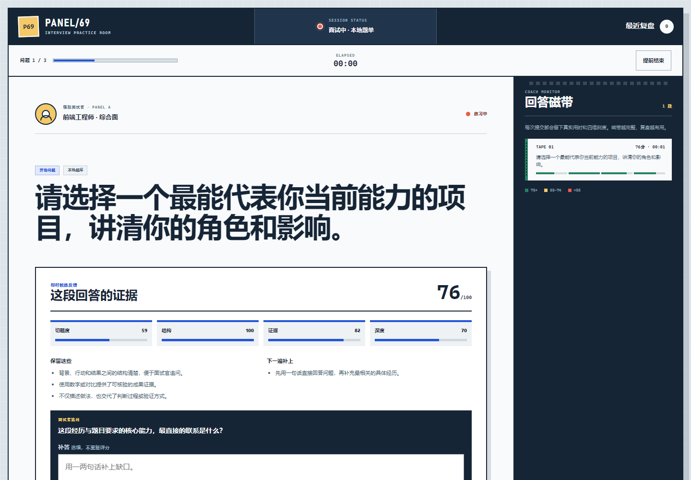

# PANEL/69 · AI 面试模拟器

100 个应用挑战的第 69 个项目。PANEL/69 把中文模拟面试做成一间安静的“面试控制室”：先按岗位生成完整本地题单，逐题记录回答，再用切题度、结构、证据和深度四个可解释维度评分。每段回答都会进入“回答磁带”，结束后可以回放问题、回答、追问和下一遍动作。



## 功能

- 前端、后端、产品、数据、设计、运营六类岗位
- 初级、中级、资深三个经验阶段，综合、专业、行为、情境四种面试类型
- 44 道本地中文题库，按种子稳定生成 3–8 道不重复题目
- 岗位描述与重点能力输入，题目一次只展示一道
- 回答草稿自动留在本机，刷新后可恢复未完成面试
- 切题度、STAR 结构、量化证据、判断深度四维可解释评分
- 每题生成一条针对最明显缺口的追问，并支持补答
- 回答磁带记录真实用时、四维刻度和逐题结果
- 整场总分、优势/薄弱维度、两项下一轮动作和可复制纯文本报告
- 最近三轮复盘保存在当前浏览器，可随时清除
- 可选服务端 AI 定制题单与反馈；任何失败都保留本地结果
- 1440px 桌面到 390px 手机响应式布局、可见键盘焦点和 reduced-motion 支持

## 两种运行方式

### 1. 完整本地练习（无需密钥）

从仓库根目录启动任意静态服务器：

```powershell
python -m http.server 4173 --bind 127.0.0.1
```

访问：

```text
http://127.0.0.1:4173/apps/069-ai-interview/
```

GitHub Pages 发布版使用此模式。题目生成、回答评分、追问、复盘、历史和导出全部可用；不会请求远程 AI。URL 加 `?offline=1` 可以明确强制本地模式，便于验收。

### 2. 服务端 AI 教练增强

PANEL/69 的 Node 服务使用 OpenAI-compatible Chat Completions 请求格式。模型名不硬编码，避免替使用者选择成本或已经变化的模型。至少设置：

```powershell
$env:AI_API_KEY="your-server-side-key"
$env:AI_MODEL="your-model-name"
node apps/069-ai-interview/server.js
```

默认地址是 `https://api.openai.com/v1`。兼容服务可以另设：

```powershell
$env:AI_BASE_URL="https://your-provider.example/v1"
$env:PORT="4173"
node apps/069-ai-interview/server.js
```

访问 `http://127.0.0.1:4173/`，并在候场登记时主动勾选“开启 AI 教练增强”。密钥只由 `server.js` 从环境变量读取，不会写入 HTML、localStorage、日志或浏览器响应。接口限制 32 KiB 请求体和 12 秒上游等待，AI 返回会再次进行字段、长度、数组、分数和 HTML 清洗。

## 评分如何工作

本地评分是练习反馈，不是机器招聘决定：

- **切题度**：回答是否覆盖当前问题与用户填写的重点能力关键词
- **结构**：是否能识别背景、目标、本人行动和结果/复盘信号
- **证据**：是否出现基线、目标、数字、对比或验证信号
- **深度**：是否解释因果、取舍、风险和验证过程，而不只列动作

总分按 35% 切题度、25% 结构、20% 证据、20% 深度合成。短回答和跳过题会被如实扣分；系统不会分析摄像头、声音、表情、年龄、性格或所谓“录用概率”。AI 增强可以改进反馈文案，但同样不能代表招聘方判断。

## 隐私与安全边界

- 默认本地模式不会上传岗位描述、回答、补答或复盘。
- AI 模式只在用户主动勾选后发送当前岗位上下文、题目和回答给服务器配置的提供商；其数据处理政策由该提供商决定。
- 浏览器只保存未完成进度和最近三轮复盘；“清除全部本地复盘”会删除已完成记录。
- 服务端只公开 `index.html`、样式、核心和浏览器控制器，测试、服务代码与 QA 脚本不可通过静态路由读取。
- AI 返回是不可信输入，必须经过本地清洗；异常、超时、缺少配置或不完整结果都会回退到本地题单和评分。
- 面试题不会主动询问年龄、婚育、宗教或疾病等与岗位无关的敏感信息。

## 测试

从仓库根目录执行：

```powershell
node --test apps/069-ai-interview/interview-core.test.js apps/069-ai-interview/ui.test.js apps/069-ai-interview/server.test.js qa/tracker.test.js
node --check apps/069-ai-interview/interview-core.js
node --check apps/069-ai-interview/app.js
node --check apps/069-ai-interview/server.js
node apps/069-ai-interview/qa/browser-smoke.mjs
```

核心测试覆盖配置边界、44 道题库、稳定选题、面试类型、四维评分、跳过、追问、整场汇总和不可信 AI 数据。服务测试覆盖静态白名单、安全头、请求边界、未配置状态、题单/评分代理与上游错误隔离。浏览器冒烟测试自动启动临时 Chrome/Edge，验证强回答、弱回答、跳过、刷新恢复、三题复盘、历史、报告复制、桌面与手机布局、键盘焦点、横向溢出和运行时异常。

## 技术栈

- 语义化 HTML、原生 CSS、原生 JavaScript
- 零依赖 UMD 面试核心与 44 道本地题库
- Node.js 内置 HTTP、Fetch、文件 API 与服务端 AI 代理
- localStorage、Clipboard API、原生 `<dialog>`
- Node.js `node:test` 与 Chrome DevTools Protocol 浏览器验收

## 快捷说明

- 回答框会自动保存当前草稿；刷新后在候场页选择“继续面试”
- “给我一个思路”只展示当前问题的一条提示，不会自动代写答案
- 追问补答不会重复计分，用于把本轮最明显的缺口说完整
- 复盘页“复制复盘报告”输出纯文本，便于贴进笔记继续修改
