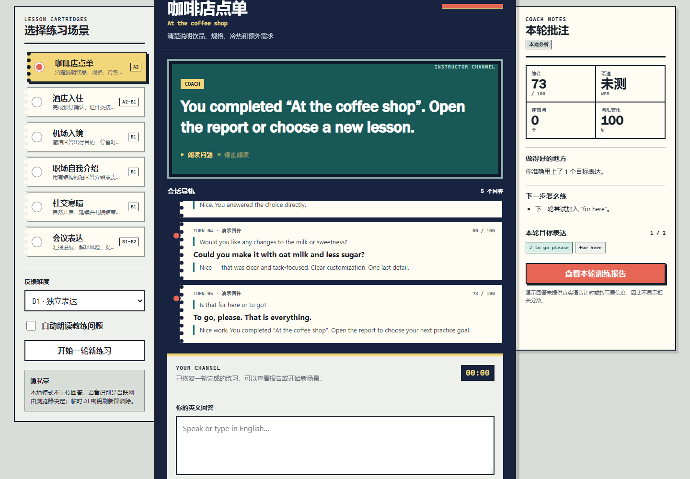

# TALKBACK/70 · AI 口语陪练

100 个应用挑战的第 70 个项目。TALKBACK 把浏览器变成一间“语言实验室”：选择现实场景，听教练提问，开口或键入英文回答，沿会话导轨完成五轮对练，最后获得一份可复制、可下载的训练报告。没有账号或 API Key 也能完成全部本地练习；临时连接兼容接口后，可以增强教练回应、表达改写和下一步建议。



## 功能

- 咖啡点单、酒店入住、机场入境、职场介绍、社交寒暄、会议表达六个场景
- 每个场景五轮问题、目标表达、关键信息和参考回答
- Chrome/Edge `SpeechRecognition` 英文实时转写与真实说话时长
- `speechSynthesis` 教练朗读，支持 A2/B1/B2 三档语速和随时停止
- 浏览器不支持、权限拒绝或没有麦克风时，可键入或载入明确标注的演示回答
- 本地分析语速、停顿词、词汇变化、目标表达和关键信息覆盖
- 键入与演示回答明确显示“语速未测”，不会把打字耗时伪装成口语 WPM
- 浏览器转写置信度只称为“清晰度参考”，不冒充音素级发音评分
- 完成五轮后聚合平均得分、真实语速、停顿词和下一轮训练目标
- 会话与最近报告保存在当前浏览器；训练报告支持复制和 TXT 下载
- 可选 OpenAI-compatible 浏览器直连，密钥仅保存在当前页面内存，刷新即清除
- 1440px 桌面到 390px 手机响应式布局、键盘焦点和 reduced-motion 支持

## 本地运行

项目是零依赖静态应用。从仓库根目录启动任意静态服务器：

```powershell
python -m http.server 4173 --bind 127.0.0.1
```

访问：

```text
http://127.0.0.1:4173/apps/070-ai-speaking-coach/
```

GitHub Pages 地址：

```text
https://jokerlixing.github.io/100apps/apps/070-ai-speaking-coach/
```

语音识别通常要求安全上下文；`localhost` 可以用于本机测试，正式发布应使用 HTTPS。不同浏览器可能把语音发送到其识别服务，离线能力与数据政策由浏览器提供商决定。TALKBACK 不会把临时识别文本写入 localStorage。

## 可选 AI 增强

点页面右上角“可选 AI 连接”，填写：

- OpenAI-compatible 接口基址，例如 `https://api.example.com/v1`
- 该服务实际提供的模型名称
- 只用于本次页面的低额度、可撤销测试密钥

应用发送兼容 `POST /chat/completions` 请求，并要求返回 `coachReply`、`rewrite` 和 `tips` JSON。AI 只增强当前轮教练回应、表达改写和建议；本地指标、场景进度和失败兜底不由模型控制。鉴权失败、限流、超时、CORS 或畸形输出都会保留本地反馈并继续下一轮。

浏览器直连无法像服务端代理一样保护密钥。密钥不会写入源码、URL、localStorage、报告或日志，但仍可被当前设备、恶意扩展或浏览器调试工具看到。不要使用生产密钥；公开产品必须改用服务端代理。

## 反馈边界

TALKBACK 的本地分数来自回答文本、真实语音计时、目标表达、关键信息和可用的浏览器转写置信度。它可以提醒语速过快、停顿词过多、回答过短或没有覆盖场景目标，但不能从浏览器转写结果可靠推断音素、重音、连读或口音准确度。

若需要专业发音评估，应接入专门的语音评测模型或由教师听取原始录音。当前版本不保存音频，也不把“识别成功”写成“发音正确”。

## 隐私与本地数据

- 本地模式不主动上传回答；浏览器语音识别服务自身可能联网。
- localStorage 只保存最终对话、设置偏好与最多十份报告摘要。
- API 密钥只存在当前页面的模块内存，刷新、关闭或主动断开后清除。
- 导出报告不包含 API 地址、模型、密钥或完整识别置信度。
- “开始一轮新练习”在已有回答时会确认，避免误清空。

## 测试

从仓库根目录执行：

```powershell
node --test apps/070-ai-speaking-coach/coach-core.test.js qa/tracker.test.js
node --check apps/070-ai-speaking-coach/coach-core.js
node --check apps/070-ai-speaking-coach/app.js
node apps/070-ai-speaking-coach/qa/browser-smoke.mjs
```

核心测试覆盖文本清洗、英文分词、停顿词、WPM、词汇变化、目标表达、场景推进、接口安全、AI 输出、损坏缓存、`null` 指标和报告聚合。浏览器冒烟测试使用临时 Chrome/Edge 配置，完成五轮演示路径，验证报告、刷新恢复、AI 失败降级、密钥不落盘、桌面与手机布局、触控尺寸和运行时异常。

## 技术栈

- 语义化 HTML、原生 CSS、原生 JavaScript
- 零依赖 UMD 教练核心与六个本地场景
- Web Speech API：`SpeechRecognition` / `webkitSpeechRecognition`、`speechSynthesis`
- Fetch、AbortController、localStorage、Clipboard 与 Blob 下载
- Node.js `node:test` 与 Chrome DevTools Protocol 浏览器验收

## 快捷操作

- `Ctrl/⌘ + Enter`：提交当前回答
- `Esc`：停止语音识别或朗读
- “载入演示回答”：在没有麦克风时验收完整流程
- “断开并清除密钥”：立即清除当前页面内存中的临时密钥
