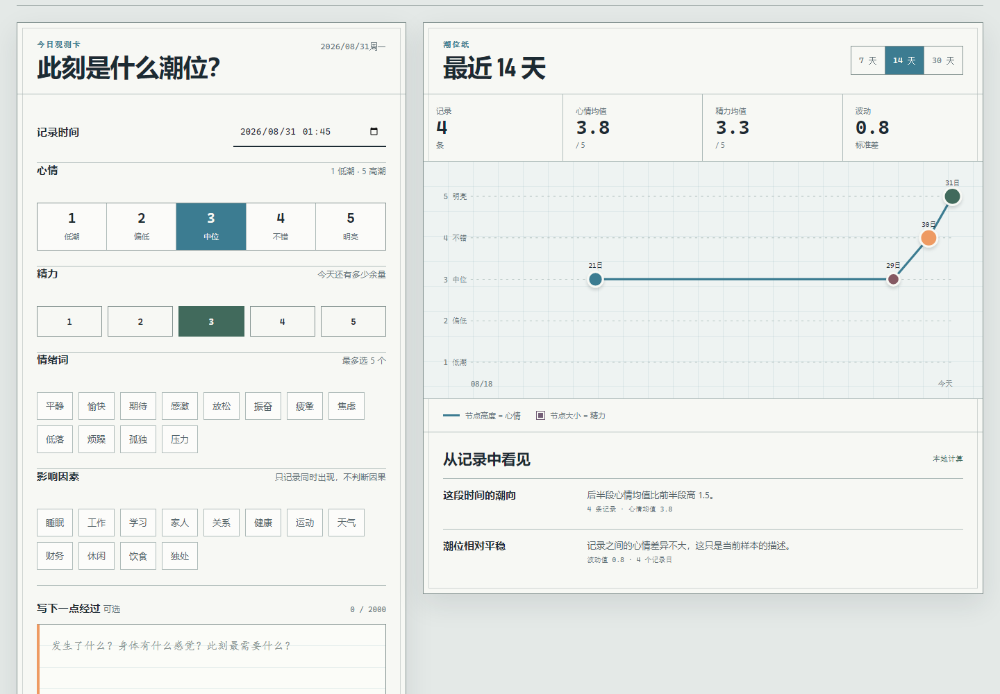

# TIDE/71 · 情绪日记

100 个应用挑战的第 71 个项目。TIDE/71 是一份本地优先的私人情绪观测簿：用心情、精力、情绪词、影响因素和可选文字记录当下，再用可复算的 7/14/30 天统计看见变化。默认模式不需要账号或网络；只有用户主动确认时，才会把预览中的最小化摘要发送到自行配置的服务端 AI。



## 功能

- 1–5 级心情与精力、12 个情绪词、12 个影响因素和 2000 字可选日记
- 创建、编辑、删除与最多 365 条本地记录，未保存草稿不会写入存储
- 7 天、14 天、30 天心情/精力均值、记录日、波动和前后段变化
- 因素至少出现 3 次才展示关联，并明确使用“同时出现”而非因果表述
- 数据驱动的“情绪潮位线”：高度表示心情，节点大小表示精力，可键盘定位记录
- 版本化 JSON 导出、导入校验、合并/替换和明确的全量清除确认
- 可选服务端 AI 反思，正文摘录默认关闭，发送前展示字段与记录数量
- 1440px 桌面到 390px 手机响应式布局、可见焦点、文字图表摘要和 reduced-motion 支持

## 两种运行方式

### 1. 静态本地日记（无需密钥）

从仓库根目录启动任意静态服务器：

```powershell
python -m http.server 4173 --bind 127.0.0.1
```

访问：

```text
http://127.0.0.1:4173/apps/071-emotion-diary/
```

GitHub Pages 发布版也使用这个模式。记录、趋势、因素模式、备份和恢复均可本地完成；`/api/insights` 不可用不会影响核心功能。

### 2. 服务端 AI 反思

Node 服务使用 OpenAI-compatible Chat Completions 请求格式。模型名不硬编码，至少设置：

```powershell
$env:AI_API_KEY="your-server-side-key"
$env:AI_MODEL="your-model-name"
node apps/071-emotion-diary/server.js
```

默认端点是 `https://api.openai.com/v1`，默认端口是 `4171`。兼容服务可另设：

```powershell
$env:AI_BASE_URL="https://your-provider.example/v1"
$env:PORT="4171"
node apps/071-emotion-diary/server.js
```

访问 `http://127.0.0.1:4171/`。密钥只由服务器从环境变量读取，不进入 HTML、localStorage、日志或浏览器响应。接口限制 48 KiB 请求体、30 条记录、每条 240 字可选摘录和 15 秒上游等待；请求和响应都会再次清洗。

## 隐私与安全边界

- 记录存储在当前浏览器的 `tide71.entries.v1`，不自动同步，不保存未提交草稿。
- AI 选择和结果不持久化。每次请求都必须重新确认；日记摘录默认不发送。
- 默认 AI 负载只含日期、心情、精力、情绪词、影响因素和汇总统计。开启摘录后，每条最多 240 字。
- 统计只描述当前样本。因素模式不证明原因，AI 文案也不能替代专业判断。
- 核心与服务端会丢弃诊断、用药或风险等级类输出，但生成内容仍可能有误。
- TIDE/71 不是医疗产品，也不执行危机识别。如果你正处于紧急危险中，请联系当地紧急服务、可信任的人或专业支持机构。

## 数据备份

“导出备份”会下载包含 `version`、导出时间和记录数组的 JSON。导入时逐条校验日期、数值、情绪词、因素、文本长度和重复 ID，并报告被拒绝条数。导入支持与现有记录合并或完全替换；替换和清空前均有确认。

## 测试

从仓库根目录执行：

```powershell
node --test apps/071-emotion-diary/emotion-core.test.js apps/071-emotion-diary/server.test.js qa/tracker.test.js
node --check apps/071-emotion-diary/emotion-core.js
node --check apps/071-emotion-diary/app.js
node --check apps/071-emotion-diary/server.js
node apps/071-emotion-diary/qa/browser-smoke.mjs
```

核心测试覆盖日期/数值边界、去重与容量、时间范围、均值/波动、因素最小样本、正文默认排除、备份导入和不可信 AI 文案。服务测试覆盖静态白名单、路径穿越、请求限制、无密钥降级、代理成功与上游错误隔离。浏览器冒烟使用临时 Chrome/Edge 配置，验证空状态、创建/编辑/删除、范围切换、持久化、导出、无效导入、AI 同意预览、桌面/手机布局、焦点和运行时错误。

## 技术栈

- 语义化 HTML、手写 CSS、原生 JavaScript 与 SVG
- 零依赖 UMD 情绪统计核心
- localStorage、Blob 下载、File API、原生 `<dialog>`
- Node.js 内置 HTTP、Fetch、文件 API 与服务端 AI 代理
- Node.js `node:test` 与 Chrome DevTools Protocol 浏览器验收

## 无障碍操作

- `Tab`：依次访问量表、标签、操作和潮位节点
- 潮位节点按 `Enter` 或空格：定位到对应文字记录
- 所有图表数据都有文字指标与观察，不依赖颜色或图形才能理解
- 系统开启“减少动态效果”后，保存节点动画会停用
