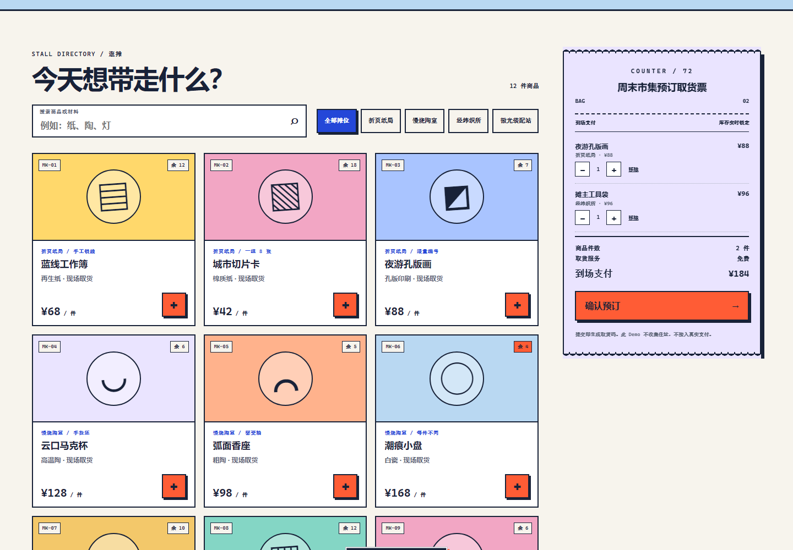

# COUNTER/72 · 全栈电商 Demo

100 个应用挑战的第 72 个项目。COUNTER/72 把普通电商结算改造成一张真实可读的“周末设计市集取货票”：顾客浏览四个摊位的十二件小物，锁定演示库存，选择取货时段，生成六位取货码，再在订单台推进备货、取货和交付状态。



## 功能

- 十二件纸品、陶器、织物和灯具商品，支持关键词与摊位筛选
- 购物袋增减、库存上限、刷新恢复与实时打孔取货票
- 服务端按可信商品目录复算金额，忽略客户端传入的名称和价格
- 取货称呼、手机号后四位、四个取货时段与明确字段校验
- 幂等提交：相同浏览器提交键重复请求只返回同一张订单
- 六位取货码与“待备货 → 可取货 → 已完成”的受控状态机
- 待备货订单可取消；可取货后只能完成交付
- 已完成订单支持两次确认后批量清空，不影响其他状态或其他店铺键的订单
- 当前浏览器 `shopKey` 订单隔离、服务端 JSON 持久化与重启恢复
- API 不可用时自动进入完整本地演示；已确认的服务端请求失败时保留购物袋
- 1440px 桌面与 390px 手机响应式布局、可见焦点和 reduced-motion 支持

## 两种运行方式

### 1. 静态本地演示

从仓库根目录启动任意静态服务器：

```powershell
python -m http.server 4173 --bind 127.0.0.1
```

访问：

```text
http://127.0.0.1:4173/apps/072-fullstack-shop/
```

GitHub Pages 采用同一模式。页面探测不到 `/api/products` 后会标记为“本地演示订单”，购物袋与订单保存在当前浏览器。URL 加 `?offline=1` 可跳过 API 探测，稳定验收本地路径。

### 2. Node 服务端订单台

无需安装依赖：

```powershell
node apps/072-fullstack-shop/server.js
```

访问 `http://127.0.0.1:4173/`。默认订单文件为 `apps/072-fullstack-shop/data/orders.json`，已被 `.gitignore` 排除。可以指定另一个位置和端口：

```powershell
$env:ORDER_STORE_PATH="C:\data\counter72-orders.json"
$env:PORT="4174"
node apps/072-fullstack-shop/server.js
```

服务端限制 JSON 请求体为 32 KiB，所有价格、库存和状态转换都由服务端校验。写入在单进程内串行，并先写同目录临时文件再替换正式文件，降低中途写坏的风险。

## API

- `GET /api/products`：返回可信商品目录
- `POST /api/orders`：创建或返回幂等订单
- `GET /api/orders?shopKey=...`：列出当前 Demo 店铺键的订单
- `PATCH /api/orders/:id`：按受控状态机更新订单
- `DELETE /api/orders/completed`：按当前 Demo 店铺键批量删除已完成订单

`shopKey` 是每个浏览器随机生成的 Demo 隔离键，不是登录凭证。任何拿到它的人都能读取和更新对应订单，因此这个项目不能直接保存真实客户资料或部署为商业商城。

## 安全、隐私与真实边界

- 不接入真实支付；页面上的金额只表示到场后可能支付的演示金额。
- 不收集完整手机号、住址、银行卡、身份证或账号密码；请不要在称呼中填写敏感信息。
- 客户端价格字段会被忽略，服务端始终使用内置目录重新计算。
- 订单查询依赖 `shopKey` 做作品集演示隔离，不提供身份认证、授权、管理员角色或多租户安全。
- JSON 文件仓库适合本机单进程 Demo，不提供跨进程事务、数据库备份、审计日志或高可用；真实业务应使用数据库、认证、权限与支付提供商。
- 静态模式数据只留在浏览器 localStorage；服务模式订单写入配置的本地 JSON 文件。

## 测试

从仓库根目录执行：

```powershell
node --test apps/072-fullstack-shop/shop-core.test.js apps/072-fullstack-shop/server.test.js qa/tracker.test.js
node --check apps/072-fullstack-shop/shop-core.js
node --check apps/072-fullstack-shop/app.js
node --check apps/072-fullstack-shop/server.js
node apps/072-fullstack-shop/qa/browser-smoke.mjs
```

领域测试覆盖购物袋清洗、库存上限、可信计价、取货信息、订单序列化、幂等与状态机。服务测试覆盖静态白名单、请求限制、客户端改价、库存、店铺隔离、重复提交、取消/履约和持久化恢复。浏览器验收覆盖实际下单闭环、刷新恢复、本地降级、桌面/手机布局、键盘焦点与运行时错误。

## 技术栈

- 语义化 HTML、原生 CSS、原生 JavaScript
- 零依赖 UMD 领域核心
- Node.js 内置 HTTP 与 File API
- JSON 文件订单仓库、localStorage、原生 `<dialog>`
- `node:test` 与 Chrome DevTools Protocol 浏览器验收
