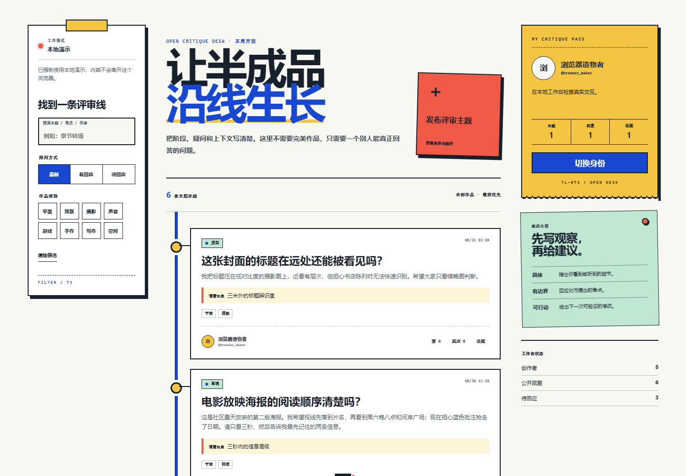

# THREADLINE/73 · 创作者评审社区

THREADLINE/73 是 100 Apps Challenge 的第 73 个项目。它把论坛缩到一条清楚的创作评审路径：选择身份，发布带阶段与反馈焦点的主题，浏览或筛选其他人的半成品，通过引用回复提出具体建议，再用点赞和收藏整理有价值的讨论。

公开体验：<https://jokerlixing.github.io/100apps/apps/073-forum-community/>



## 核心功能

- 主题发布：标题、作品阶段、反馈焦点、1–3 个标签与完整上下文。
- 论坛浏览：关键词搜索、标签过滤、最新、回应热度与待回应排序。
- 讨论互动：主题点赞/收藏、评论点赞、同主题引用回复和个人贡献统计。
- 两种身份模式：GitHub Pages 上的浏览器本地演示身份；Node 模式中的注册、登录、退出与不透明会话令牌。
- 诚实的离线回退：API 不可用时自动切到 localStorage，也可用 `?offline=1` 强制检查静态模式。
- 无外部素材依赖：视觉、图标和时间线全部由 HTML/CSS 生成，离线仍能完整显示。

## 运行方式

直接打开 `index.html`，或通过任意静态服务器访问，即可进入本地演示模式。身份、主题与互动保存在当前浏览器的 `threadline73_forum_v1`；它们不会跨设备同步，也不代表真实认证。

运行 Node 持久化模式：

```powershell
node server.js
```

默认地址是 `http://127.0.0.1:4173`。可用以下环境变量调整：

- `PORT`：监听端口。
- `FORUM_STORE_PATH`：JSON 数据文件路径；默认是 `data/forum.json`。

Node 模式使用内置 `crypto.scrypt` 加随机盐保存密码派生值，不保存明文密码；会话令牌由安全随机数生成，服务端只持久化令牌哈希。客户端不能指定发帖作者、回复作者或互动计数。

## API 摘要

- `GET /api/bootstrap`：公开用户、主题及当前会话用户。
- `POST /api/register`、`POST /api/login`、`POST /api/logout`：账号与会话。
- `POST /api/posts`：发布主题，要求 Bearer 会话和幂等键。
- `POST /api/posts/:id/comments`：发布或引用回复。
- `POST /api/posts/:id/reactions`：切换点赞或收藏。
- `POST /api/posts/:id/comments/:commentId/like`：切换评论点赞。

所有 JSON 请求限制为 48 KiB。静态服务使用明确的文件白名单，公开序列化不会返回密码派生值、会话哈希、点赞用户数组或收藏用户数组。

## 验证

```powershell
node --test forum-core.test.js server.test.js
node --check forum-core.js
node --check app.js
node --check server.js
node qa/browser-smoke.mjs
```

浏览器冒烟会启动临时 Node 数据仓库和临时 Chrome 配置，覆盖本地身份、发帖、筛选、点赞收藏、引用回复、刷新恢复、服务端注册登录、桌面/移动布局、键盘焦点和运行时错误，并生成：

- `assets/screenshot-desktop.png`
- `assets/screenshot-mobile.png`

## 隐私与边界

这是作品集 Demo，不是生产论坛。没有邮箱验证、密码找回、内容审核、封禁、附件上传、CSRF Cookie 或多实例一致性。JSON 仓库适合单进程本地演示，不适合公网多用户部署。不要输入真实密码、邮箱、私人作品或敏感内容；如需生产化，应迁移到数据库、短期会话与成熟的审核/限流方案。

键盘用户可以使用跳转链接、完整焦点环、原生 `<dialog>` 与已关联的表单标签；移动端核心触控目标不小于 44px，并在 `prefers-reduced-motion` 下取消过渡动画。

## 技术栈

原生 HTML、CSS、JavaScript、localStorage、Node.js 内置 HTTP/Crypto/File API、`node:test` 与 Chrome DevTools Protocol。无运行时第三方依赖。
