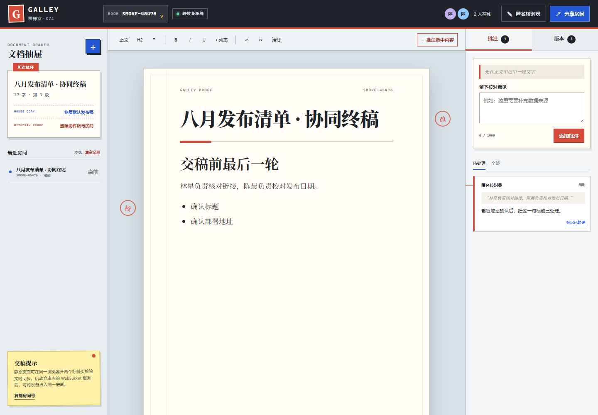

# GALLEY/74 · 在线协同文档

100 个应用挑战的第 74 个项目。GALLEY/74 把浏览器变成一张编辑部校样桌：成员进入同一房间后共同修改文档、留下可解决的批注、查看历史版本，并在误改后把旧稿恢复成一个新版本。用户可以把当前稿保留为历史并恢复内置默认发布稿；确认输入房间号后，也可以删除整个房间及其正文、批注和版本，让所有当前协作者一起进入同一个新房间。旧房间号随后可重新使用，并会创建一份全新的默认稿。GitHub Pages 页面无需账号或密钥，打开两个同源标签页即可验证本机实时协作；启动仓库内的 WebSocket 服务后，可在局域网或已部署的服务上跨设备协作。



## 功能

- 房间链接、显示名、连接状态与在线成员头像
- 标题、正文、二级标题、引用、粗体、斜体、下划线和列表编辑
- 240ms 自动保存与明确的“本机协作 / 跨设备在线”线路状态
- `BroadcastChannel` 同浏览器多标签页实时同步与 `localStorage` 刷新恢复
- WebSocket 房间快照、成员状态、断线本机降级与自动重连
- 选中文字后添加批注、待处理筛选、解决与重新打开
- 最近 16 个版本的元数据与正文历史，恢复旧稿时生成新版本
- 一键恢复 GALLEY/74 默认发布稿，恢复前的当前内容自动保留为历史版本
- 输入房间号二次确认后删除房间实例、正文、批注和全部版本，并让所有成员同步进入一个新房间
- 最近房间抽屉与一键清空记录、新建房间、复制房间号与分享链接；清空记录不会删除房间或稿件
- JSON 备份导入导出、独立 HTML 文档导出
- 1440px 桌面三栏和 390px 手机单面板布局
- 可见键盘焦点、语义化标签、打印样式和 reduced-motion 支持

## 在线体验

```text
https://jokerlixing.github.io/100apps/apps/074-collaborative-document/
```

GitHub Pages 只能托管静态文件，无法接受 WebSocket Upgrade。因此在线地址会明确显示“本机协作”，支持同一浏览器、同一站点、同一房间的多个标签页同步；它不会把这种模式描述成互联网跨设备协作。

## 启动 WebSocket 协作服务

```powershell
cd apps/074-collaborative-document
npm install
npm start
```

默认访问：

```text
http://127.0.0.1:8765/?room=GALLEY-74
```

要让同一局域网中的其他设备访问，可监听全部网卡：

```powershell
$env:HOST="0.0.0.0"
npm start
```

若前端和服务端分别部署，可在静态页面 URL 中指定 TLS WebSocket 地址：

```text
?room=TEAM-DOC&ws=wss://example.com/ws
```

房间内容只保存在服务进程内存中，最后一名成员离开 30 分钟后释放。需要长期保留时，应在浏览器导出 JSON 备份；当前版本不提供账号、数据库或服务器文件存储。

## 同步模型与冲突边界

协议版本为 `v: 1`，核心消息包括：

- `join` / `snapshot` / `presence`
- `document:update` / `document:conflict`
- `document:delete` / `document:deleted`（兼容清空协作稿）
- `room:delete` / `room:deleted`（删除房间并协调成员迁移）
- `version:restore` / `version:restored`
- `ping` / `pong` / `error`

服务端以单调递增的房间 `revision` 为权威。客户端提交时必须携带 `baseRevision`；旧版本更新会收到权威快照，并在最新版本上重新发送尚未保存的本地修改。恢复默认发布稿走同一更新协议：当前稿先进入历史，内置标题与正文成为新版本；若确认期间同伴更新，确认会关闭，若提交后发生版本冲突则显示权威最新稿且不会自动重试恢复。删除房间同样需要最新版本号，若确认期间同伴完成了编辑或恢复，删除确认会关闭并要求用户查看最新稿后重新输入房间号。删除成功后，服务端从内存中移除旧房间，向全部成员广播同一个替代房间号，再关闭旧连接；本机模式通过 `BroadcastChannel` 和 storage 事件执行同样的清理与跳转。旧房间号不会被永久拉黑，之后重新访问会得到一份独立的默认稿。当前版本没有账号或角色权限，任何已加入房间的成员都能发起删除。这个模型适合小团队共同编辑短文档，但它是受版本号保护的整份快照同步，不是 CRDT 或 OT：两个人同时修改同一段时，较晚被服务端接受的整份稿件会成为当前版本。产品界面和说明不会把它宣传成无损字符级并发合并。

## 安全与资源限制

- 标题最多 120 字，正文 HTML 最多 120,000 字符
- 每房间最多 24 名 WebSocket 成员、200 条批注、16 份历史正文
- 单条批注最多 1,000 字，引用摘要最多 280 字
- 单个 WebSocket 载荷最大 192KB，每成员 10 秒最多 30 次写操作
- 客户端仅保留基础排版标签并删除全部属性
- 服务端拒绝脚本、嵌入内容、事件属性和危险 `href/src` 协议
- 姓名、批注、版本和成员信息通过 `textContent` 创建，不拼接远端 HTML
- HTTP 服务只公开页面、样式、浏览器脚本和截图，不公开服务端、测试、依赖或包清单
- `ws` 锁定到通过当前 `npm audit` 的 8.21.3

## 测试

在应用目录执行：

```powershell
npm test
npm run test:browser
npm audit --audit-level=high
node --check sync-core.js
node --check server.js
node --check app.js
```

核心与服务端测试覆盖输入裁剪、危险 HTML、版本冲突、历史裁剪、恢复、删除房间、旧房间重新创建、健康检查、静态文件边界、真实 WebSocket 快照、成员、房间隔离和批注同步。浏览器烟测启动临时服务和无头 Chrome/Edge，分别在两个 WebSocket 标签页和两个本机协作标签页中完成编辑、成员同步、批注、版本恢复、清空最近房间且保留稿件、房间号删除确认、成员同步迁移、旧房间清理与重建、默认稿恢复、并发确认失效、JSON/HTML 下载，并检查桌面与 390px 手机布局以及运行时异常。

需要重新生成 README 截图时：

```powershell
$env:UPDATE_SCREENSHOTS="1"
npm run test:browser
```

## 技术栈

- 语义化 HTML、原生 CSS、原生 JavaScript
- `contenteditable`、Selection/Range、BroadcastChannel、localStorage、Blob
- Node.js 18+、`ws` 8.21.3、`node:test`
- Chrome DevTools Protocol 双标签页浏览器验收

## 项目信息

- 100 Apps Challenge：App #074
- 产品代号：GALLEY/74
- 视觉主题：编辑部校样桌 / 红铅笔批注轨道
- 部署模式：GitHub Pages 本机协作 + 可选 WebSocket 跨设备服务
