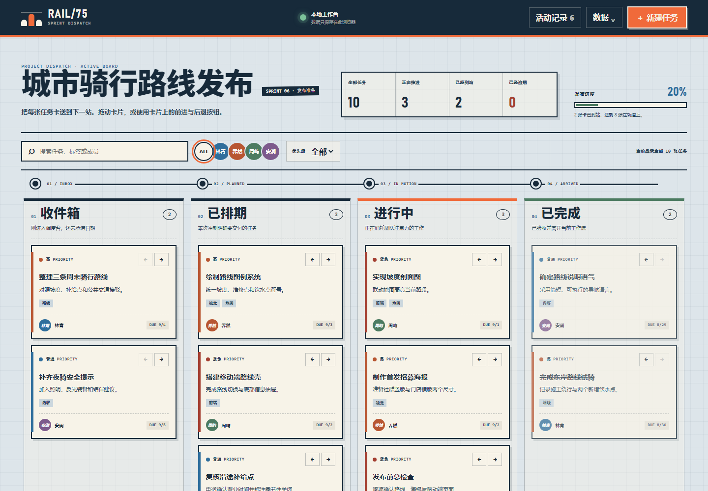

# RAIL/75 · 项目管理看板

100 个应用挑战的第 75 个项目。RAIL/75 把团队冲刺做成一张交通调度蓝图：任务卡从“收件箱”经过“已排期”和“进行中”，最终抵达“已完成”。它适合演示 3–6 人小团队的工作流，不需要账号或构建步骤。



## 功能

- 四列项目看板：收件箱、已排期、进行中、已完成
- 鼠标拖拽支持跨列流转和列内排序
- 卡片前进/后退按钮提供触屏与键盘替代操作
- 任务标题、说明、负责人、优先级、截止日期和最多 5 个标签
- 创建、编辑、删除和最多 80 条活动记录
- 关键词、成员和优先级组合筛选
- 全部、进行中、完成、逾期与完成率统计
- 浏览器 `localStorage` 自动保存，刷新后恢复
- JSON 导出、原子导入校验和一键恢复示例看板
- 1440px 桌面与 390px 手机响应式布局、可见焦点和 reduced-motion 支持

## 运行

从仓库根目录启动任意静态服务器：

```powershell
python -m http.server 4173 --bind 127.0.0.1
```

然后访问：

```text
http://127.0.0.1:4173/apps/075-project-board/
```

线上地址：<https://jokerlixing.github.io/100apps/apps/075-project-board/>

## 数据与真实边界

- 看板数据只存储在当前浏览器的 `rail75-board-v1` 键中，不会上传到服务器。
- “成员”是演示项目中的本地负责人名单，不代表真实用户账号。
- 本项目没有登录、权限、通知或云端实时协作，不能直接作为生产团队系统。
- JSON 导入上限为 512 KiB；导入前会验证根结构、成员、状态、优先级、日期和任务字段，失败时不会覆盖当前看板。
- 浏览器清理站点数据会删除本地看板；重要演示数据请先导出 JSON。

## 键盘与触屏

- `Tab` 可依次访问筛选、成员、卡片、流转按钮和列底部新建按钮。
- 卡片获得焦点后按 `Enter` 或空格可打开编辑。
- 不使用拖拽时，可用卡片右上角的 `←` / `→` 在列之间流转。
- 对话框打开后焦点进入标题字段，关闭后返回原触发控件。

## 验证

```powershell
node --test apps/075-project-board/board-core.test.js
node --check apps/075-project-board/board-core.js
node --check apps/075-project-board/app.js
node apps/075-project-board/qa/browser-smoke.mjs
node --test qa/tracker.test.js
git diff --check
```

浏览器冒烟测试使用临时 Chromium 配置，覆盖新建、编辑、筛选、按钮流转、HTML 拖放、刷新持久化、活动面板、桌面/移动布局、焦点和运行时错误，并重新生成：

- `assets/screenshot-desktop.png`
- `assets/screenshot-mobile.png`

## 文件

- `board-core.js`：可测试的状态清洗、任务变更、移动、筛选与统计规则
- `app.js`：DOM 渲染、本地持久化、对话框、拖拽和数据导入导出
- `styles.css`：蓝图调度台视觉与响应式布局
- `qa/browser-smoke.mjs`：无需第三方依赖的 Chromium CDP 验收
