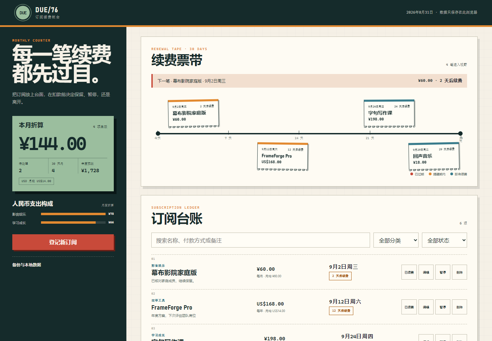

# DUE/76 · 订阅管理

DUE/76 是一个本地优先的订阅台账，把未来 30 天续费、提前提醒、月度折算和年度预测放在同一个“续费柜台”中。它不要求账号，也不会连接银行卡或自动执行扣款。



## 功能

- 登记、编辑、暂停、恢复、删除订阅
- 标记“已续费”，按账单周期推进下次续费日
- 未来 30 天续费票带与逾期、提醒期内、即将续费状态
- 周付、月付、季付、年付的月度折算与年度预测
- CNY、USD、EUR、JPY、HKD 分币种统计，不进行虚假汇率相加
- 按名称、付款方式、备注、分类和状态筛选
- JSON 备份导出，以及校验后的合并或替换导入
- 桌面与 390px 移动布局、键盘焦点、减少动画偏好和打印样式

## 数据与计算边界

订阅保存在浏览器 `localStorage` 的 `due76.subscriptions.v1`，上限为 200 项。应用不会上传这些数据；清理浏览器站点数据会一并删除账本，因此重要数据请先导出 JSON 备份。

月度折算规则：

- 周付：金额 × 52 ÷ 12
- 月付：金额
- 季付：金额 ÷ 3
- 年付：金额 ÷ 12

年度预测为月度折算 × 12。不同币种单独显示，应用不联网获取汇率。提醒状态只在页面打开时根据本地日期计算；浏览器关闭后不会发送系统通知。

## 本地运行

在仓库根目录启动静态服务器：

```powershell
python -m http.server 4173 --bind 127.0.0.1
```

访问：

```text
http://127.0.0.1:4173/apps/076-subscription-manager/
```

公开地址：

```text
https://jokerlixing.github.io/100apps/apps/076-subscription-manager/
```

## 验证

```powershell
node --test apps/076-subscription-manager/subscription-core.test.js
node --check apps/076-subscription-manager/subscription-core.js
node --check apps/076-subscription-manager/app.js
node apps/076-subscription-manager/qa/browser-smoke.mjs
```

浏览器冒烟使用临时 Chrome/Edge 配置，验证空状态、示例账本、新增、编辑、暂停、续费推进、删除、筛选、导出、无效导入、本地持久化、键盘焦点、桌面与移动端无横向溢出，并生成桌面和移动证据图。
