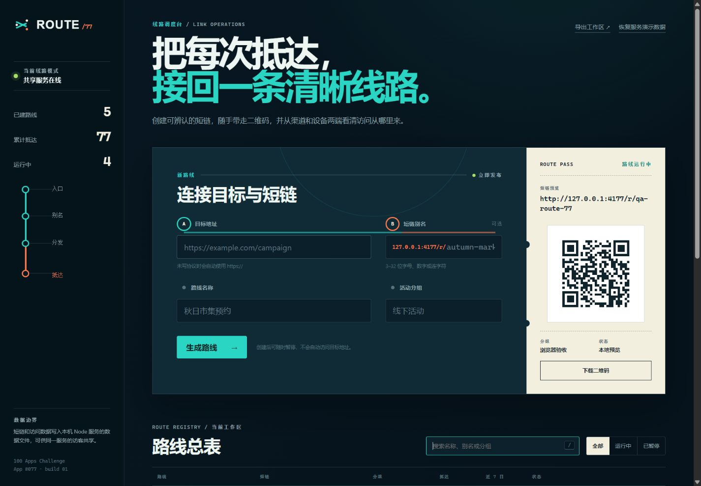

# ROUTE/77 · 短链聚合平台

100 个应用挑战的第 77 个项目。ROUTE/77 把短链后台做成一张“城市线路调度台”：输入目标地址与可选别名即可发布路线，二维码票据随即生成；每次抵达按日期、渠道和设备进入报告，暂停路线则立即停止跳转。



## 功能

- HTTP/HTTPS 目标地址校验，自动补全 `https://`，拒绝脚本协议与内嵌账号密码
- 3–32 位自定义别名、自动别名、系统保留词与重复冲突检查
- 可复制短链、可扫描二维码预览与 PNG 下载
- 路线搜索、运行/暂停筛选、状态切换和二次确认删除
- 近七日访问柱状图、来源排行和手机/桌面/平板设备占比
- 四条可恢复演示路线、版本化本地存储与 JSON 工作区导出
- 静态短链入口 `?go=slug`：在当前浏览器解析、记一次访问，再由用户确认离开
- Node 短链入口 `/r/:slug`：返回真实 302 跳转并持久化共享访问统计
- 1440px 桌面和 390px 手机响应式布局、键盘焦点与 reduced-motion 支持

## 两种运行方式

### 1. GitHub Pages / 静态本地演示

从仓库根目录运行任意静态服务器：

```powershell
python -m http.server 4173 --bind 127.0.0.1
```

访问：

```text
http://127.0.0.1:4173/apps/077-short-link-hub/?offline=1
```

页面会显示“浏览器本地演示”。路线和访问统计只保存在当前浏览器的 localStorage；静态短链不能跨浏览器或跨设备共享。二维码算法由 MIT License 的 `qrcode-generator 1.4.4` 从 jsDelivr 加载，但二维码内容在浏览器内生成，不提交给二维码服务。

### 2. Node 共享服务模式

项目零运行时依赖：

```powershell
node apps/077-short-link-hub/server.js
```

访问 `http://127.0.0.1:4177/`。应用探测到同源 API 后会显示“共享服务在线”，创建的短链可通过 `/r/:slug` 在同一服务内真实跳转与计数。

默认数据文件是 `apps/077-short-link-hub/data/links.json`，已被 `.gitignore` 排除。可指定端口和存储位置：

```powershell
$env:PORT="4180"
$env:ROUTE_STORE_PATH="C:\data\route-77-links.json"
node apps/077-short-link-hub/server.js
```

## API

- `GET /api/health`：模式探测
- `GET /api/links`：读取路线和访问数据
- `POST /api/links`：创建路线
- `PATCH /api/links/:id`：修改状态或路线字段
- `DELETE /api/links/:id`：删除路线
- `POST /api/reset`：恢复演示工作区
- `GET /r/:slug?src=wechat`：记录来源和设备后 302 跳转
- `HEAD /r/:slug`：检查路线状态，不增加访问数

服务端将 JSON 请求限制为 32 KiB，所有目标地址、别名和状态都重新校验；写入采用单进程串行队列和同目录临时文件替换。

## 安全、隐私与真实边界

- 静态模式不是云端短链服务；其数据不会同步，换设备后无法解析用户新建的本地路线。
- Node 模式是本机作品集 Demo，不含登录、租户隔离、访问权限、TLS、域名绑定或数据库事务，不能直接作为公共商业短链服务部署。
- 访问记录仅保存时间、归类后的来源和设备类型；不会保存 IP、完整 User-Agent 或完整 Referer。
- 跳转目标只允许 HTTP/HTTPS，但服务不会替用户判断第三方页面内容是否可信；跳转前应核对目标域名。
- 默认 CSP 只允许同源资源及 jsDelivr 的二维码脚本，静态文件采用白名单，不提供任意路径读取。

## 测试

从仓库根目录执行：

```powershell
node --test apps/077-short-link-hub/route-core.test.js apps/077-short-link-hub/server.test.js qa/tracker.test.js
node --check apps/077-short-link-hub/route-core.js
node --check apps/077-short-link-hub/app.js
node --check apps/077-short-link-hub/server.js
```

领域和服务测试覆盖 URL/别名、重复、七日聚合、来源/设备、静态白名单、创建、302 跳转计数、HEAD 无计数、暂停、删除、请求限制和 JSON 持久化。浏览器验收覆盖共享模式探测、真实创建、二维码渲染、搜索、筛选、复制、1440px 桌面和 390px 手机布局，并检查控制台无错误。

## 技术栈

- 语义化 HTML、原生 CSS、原生 JavaScript
- localStorage、Canvas、Clipboard、`<dialog>`
- Node.js 内置 HTTP 与 File API
- 零依赖 UMD 领域核心、`node:test`
- `qrcode-generator 1.4.4`（MIT，CDN 脚本、本地生成）
