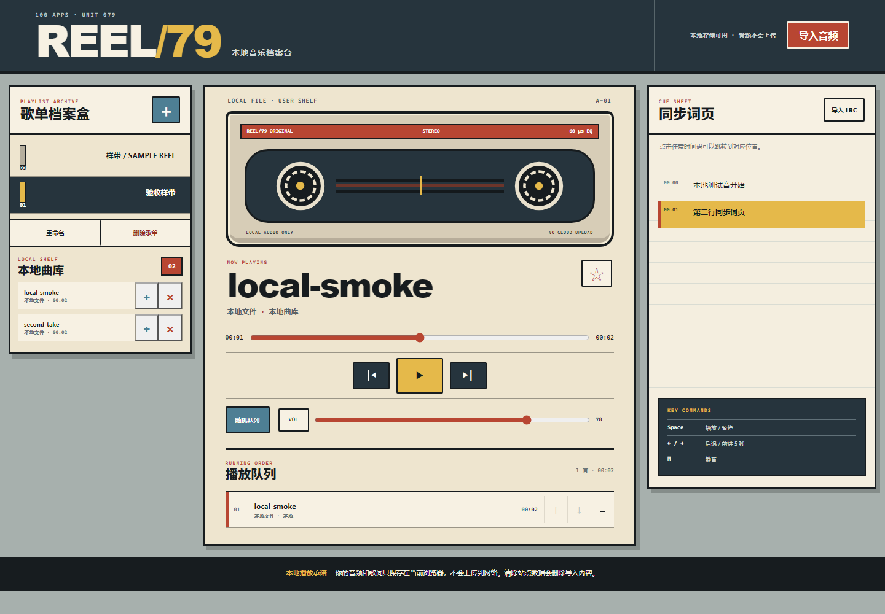

# REEL/79 · 本地音乐播放器

100 个应用挑战的第 79 个项目。REEL/79 是一台本地优先的浏览器音乐档案台：首次打开可以播放三首原创合成样带，也可以把自己的音频和 LRC 词页保存在当前浏览器中，整理成多份歌单后离线播放。页面不需要账号、密钥或第三方曲库，也不会把音频上传到网络。



## 功能

- 三首浏览器实时合成的原创示例曲目，GitHub Pages 首次打开即可真实播放
- 导入 MP3、WAV、M4A、AAC、OGG、FLAC 或 WebM 等浏览器支持的本地音频
- IndexedDB 音频 Blob 与 localStorage 元数据分层保存，刷新后恢复但不会自动播放
- 新建、重命名、删除歌单；从本地曲库加入曲目；队列上移、下移和移除
- 播放、暂停、上一首、下一首、拖动进度、音量与静音
- 顺序、随机、单曲循环、列表循环四种播放模式
- UTF-8 LRC 导入、多时间码与 `[offset]` 支持、当前行滚动和点击歌词跳转
- 曲目收藏、上次进度恢复、Media Session 系统媒体控制与键盘快捷键
- 1440px 桌面到 390px 手机响应式布局、可见焦点、状态播报和 reduced-motion 支持

## 运行

从仓库根目录启动任意静态服务器：

```powershell
python -m http.server 4173 --bind 127.0.0.1
```

访问：

```text
http://127.0.0.1:4173/apps/079-music-player/
```

GitHub Pages 发布地址：

```text
https://jokerlixing.github.io/100apps/apps/079-music-player/
```

首次播放示例样带需要点击播放按钮，以满足浏览器的音频手势策略。示例音乐通过 Web Audio API 在浏览器中实时合成，不会下载远程音频。

## 本地音频与存储边界

- 音频 Blob 存在当前站点的 `reel79.library.v1` IndexedDB 中，歌单、歌词、音量、模式和进度存在 `reel79.state.v1` localStorage 中。
- 文件名、曲目资料和歌词只通过 `textContent` 渲染；LRC 文本不会作为 HTML 执行。
- 单次最多选择 20 个文件，每个文件最多 80 MiB；最终能否播放由当前浏览器的编解码器决定。
- 如果 IndexedDB 不可用或配额不足，音频仍可在当前会话播放，界面会明确提示它不会跨刷新保存。
- 删除本地音频会同时从所有歌单、进度、收藏和 IndexedDB 中移除；删除歌单不会删除曲库文件。
- 清除浏览器站点数据、隐私数据或浏览器配置会删除导入内容，项目不会自动同步或建立云端副本。

## LRC 词页

先选中一首本地音频，再点击右侧“导入 LRC”。支持常见标签：

```text
[ti:曲名]
[ar:作者]
[offset:500]
[00:12.50]第一行歌词
[00:18.00][00:42.00]可复用的歌词
```

`offset` 以毫秒计，限制在正负 30 秒；有效时间行最多 1200 行。导入词页与曲目元数据一起保存在 localStorage 中。

## 操作

- `Space`：播放或暂停（焦点不在表单和按钮时）
- `←` / `→`：后退或前进 5 秒
- `M`：静音或取消静音
- 点击同步词页：跳转到该时间
- 系统媒体面板：在浏览器支持时提供播放、暂停、切歌和跳转

## 测试

从仓库根目录执行：

```powershell
node --test apps/079-music-player/player-core.test.js qa/tracker.test.js
node --check apps/079-music-player/player-core.js
node --check apps/079-music-player/app.js
node apps/079-music-player/qa/browser-smoke.mjs
git diff --check
```

核心测试覆盖时间格式、LRC 多时间码与偏移、歌词二分定位、不可信曲目与歌单规范化、状态修复、队列移动、全局删除、确定性随机顺序和循环边界。浏览器冒烟使用临时 Chrome/Edge 配置与生成的本地 WAV/LRC 文件，验证示例真实计时、暂停/跳转、播放模式、歌单创建/重命名、双音频导入、同步歌词、队列排序/移除、刷新恢复、桌面与手机布局、键盘焦点和运行时错误，并生成 README 所用截图。

## 技术栈

- 语义化 HTML、手写 CSS、原生 JavaScript
- Web Audio API 与 HTMLMediaElement
- IndexedDB、localStorage、File API、Blob/Object URL
- Media Session API 与原生 `<dialog>`
- 零依赖 UMD 播放核心、Node.js `node:test`
- Chrome DevTools Protocol 浏览器验收

## 兼容与降级

Web Audio API 不可用时，原创示例样带不会播放，但本地 `<audio>` 导入仍可工作。IndexedDB 不可用时降级为会话模式。Media Session 不可用时页面内控制与键盘快捷键不受影响。页面不依赖服务端，因此可以直接部署到 GitHub Pages。
