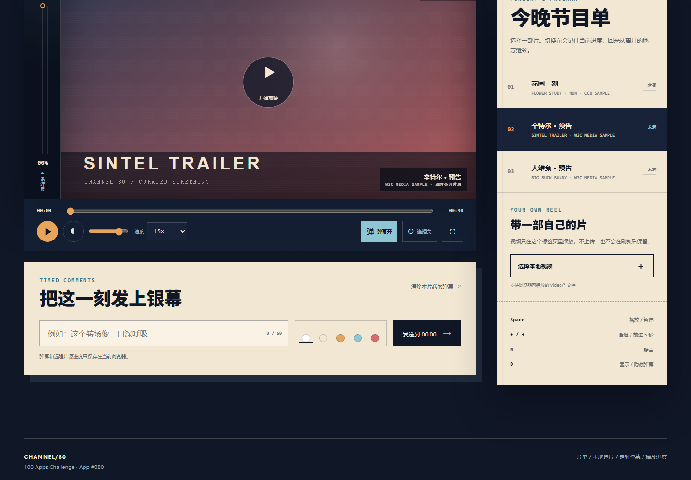

# CHANNEL/80 · 放映局

100 个应用挑战的第 80 个项目。CHANNEL/80 是一个可直接部署在 GitHub Pages 的视频网站 Demo：从三部公开短片中选片，使用自定义播放控制，在当前时间发送弹幕，并在下次打开时从离开的地方继续。用户也可以选择电脑里的视频，把它临时加入节目单，全程不上传。



## 功能

- 三部内置公开示例短片，节目单可随时切换
- 播放/暂停、进度拖动、音量、静音、五档倍速和全屏
- 自动连播可开关，播完后按节目单顺序进入下一部
- 定时弹幕支持五种颜色、六条轨道、显示/隐藏和按片清除
- 弹幕清洗控制字符并限制 60 字，用户内容只通过 `textContent` 渲染
- 当前远程片源、播放进度、弹幕与播放器设置保存在 localStorage
- 本地 `video/*` 文件通过对象 URL 临时播放，不读取上传、不持久化
- 片源失败时提供明确恢复入口，可换片或选择本地视频
- Space、左右方向键、M、D 快捷键
- 1440px 桌面与 390px 手机响应式布局、可见键盘焦点和 reduced-motion 支持

## 运行

项目没有构建步骤，也没有 npm 依赖。从仓库根目录启动任意静态服务器：

```powershell
python -m http.server 4173 --bind 127.0.0.1
```

访问：

```text
http://127.0.0.1:4173/apps/080-video-site/
```

部署入口：

```text
https://jokerlixing.github.io/100apps/apps/080-video-site/
```

直接双击 `index.html` 通常也能打开，但浏览器对远程媒体、全屏或本地文件的策略可能不同，推荐使用本地静态服务器验收。

## 片源与隐私边界

- 内置 `flower.mp4` 来自 MDN CC0 媒体示例，另两部预告来自 W3C 媒体示例；仓库不复制或再分发大体积视频文件。
- 内置片源依赖网络与来源站可用性。某一片源无法加载时可换片，本地选片不依赖这些远程地址。
- 本地文件仅由浏览器生成对象 URL；文件二进制、文件路径和对象 URL都不会写入 localStorage，关闭当前页面后释放。
- 远程视频的当前进度、用户弹幕、音量、倍速、弹幕开关和连播开关保存在当前浏览器。
- 这是无账号、无后端的作品集 Demo，不提供视频上传、审核、版权管理、跨设备同步或用户身份。

## 测试

从仓库根目录执行：

```powershell
node --test apps/080-video-site/video-core.test.js
node --check apps/080-video-site/video-core.js
node --check apps/080-video-site/app.js
node apps/080-video-site/qa/browser-smoke.mjs
```

核心测试覆盖弹幕清洗与规范化、去重与裁剪、按片/时间筛选、轨道分配、进度边界、时间格式、连播规则、设置与进度恢复。浏览器验收使用确定性的 Media API 替身，不依赖远程视频状态，覆盖片单切换、弹幕发送与持久化、开关设置、本地选片、桌面/手机布局、键盘焦点和运行时错误；同时输出两张已验证截图到 `assets/`。

## 技术栈

- 语义化 HTML、原生 CSS、原生 JavaScript
- 原生 `<video>`、Media API、File/Object URL API、Fullscreen API
- localStorage 与零依赖 UMD 领域核心
- `node:test` 与 Chrome DevTools Protocol 浏览器验收
