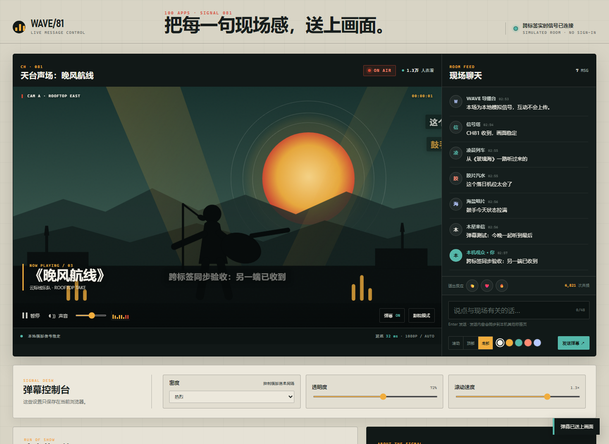

# WAVE/81 · 直播弹幕系统

100 个应用挑战的第 81 个项目。WAVE/81 是一间可以直接在浏览器运行的模拟直播间：天台音乐画面、滚动/顶部/底部弹幕、现场聊天、快捷反应和信号控制台共同组成一个完整的互动闭环。



## 功能

- 滚动、顶部、底部三种弹幕轨道，带轨道冷却与自动避让
- 五种弹幕颜色、35%–100% 透明度、0.7×–1.5× 速度和三档密度
- 本地环境消息、聊天记录、动态观众数、时间码和模拟电平表
- 掌声、爱心、火焰快捷反应，以及独立的舞台粒子动画
- 暂停/恢复信号、显示/隐藏弹幕、静音和影院模式
- `BroadcastChannel` 跨标签页同步；不支持时自动回退到 `storage` 事件
- 偏好保存在当前浏览器，刷新后保留；聊天内容不持久化
- 1440px 桌面到 390px 手机响应式布局、可见焦点和 reduced-motion 支持

## 运行

项目是纯静态站点。从仓库根目录启动任意静态服务器：

```powershell
python -m http.server 4173 --bind 127.0.0.1
```

访问：

```text
http://127.0.0.1:4173/apps/081-live-danmaku/
```

GitHub Pages 发布地址：

```text
https://jokerlixing.github.io/100apps/apps/081-live-danmaku/
```

## 实时边界

这是一个诚实的本地模拟系统，不连接真实视频流或远端聊天室。页面画面、环境消息、观众数与延迟读数都在浏览器本地生成；用户输入只进入当前页面和同源、同设备的其他标签页，不上传到服务器。

`BroadcastChannel` 可让两个同时打开的标签页实时收发弹幕和反应。若浏览器不支持它，应用使用 `localStorage` 的 `storage` 事件作为回退；若本地存储也不可用，单标签页内的所有核心功能仍然可用。

## 测试

从仓库根目录执行：

```powershell
node --test apps/081-live-danmaku/danmaku-core.test.js apps/081-live-danmaku/ui.test.js
node --check apps/081-live-danmaku/danmaku-core.js
node --check apps/081-live-danmaku/app.js
node --check apps/081-live-danmaku/qa/browser-smoke.mjs
node apps/081-live-danmaku/qa/browser-smoke.mjs
```

单元测试覆盖消息清洗、长度与白名单校验、轨道选择、偏好归一、观众数格式化、环境消息节奏和防连发。浏览器验收覆盖三种弹幕、快捷反应、暂停/恢复、隐藏、静音、影院模式、偏好持久化、跨标签页同步、桌面/手机无溢出、截图和运行时错误。

## 技术栈

- 语义化 HTML、手写 CSS、原生 JavaScript 与内联 SVG
- 零依赖 UMD 弹幕领域核心
- `BroadcastChannel`、`localStorage`、`requestAnimationFrame`
- Node.js 内置 `node:test`
- Chrome DevTools Protocol 浏览器验收

## 快捷键

- `D`：显示 / 隐藏弹幕
- `T`：进入 / 退出影院模式
- `M`：静音 / 恢复模拟声音
- `Enter`：输入框聚焦时发送弹幕

键盘焦点位于输入框、选择器或其他可编辑控件时，单键快捷操作不会触发。
