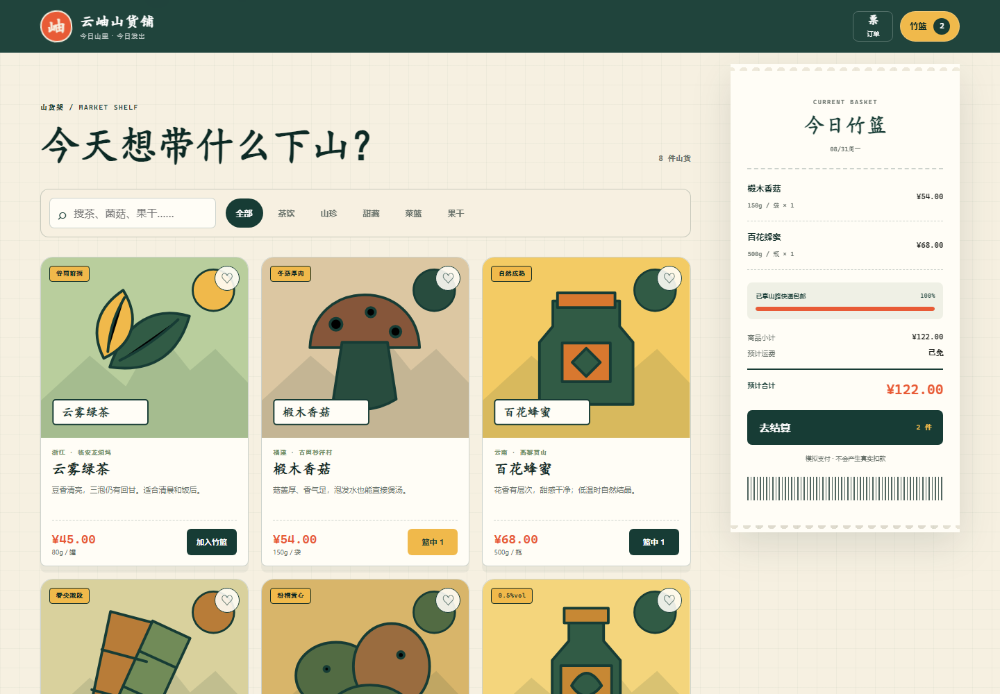
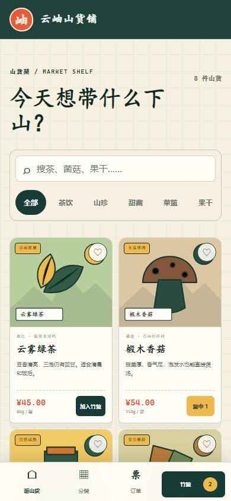

# 云岫山货铺 · App 082

100 Apps Challenge 的第 82 个项目。云岫山货铺是一款可在普通浏览器直接体验的微信小程序商城模拟器：从八样当季山货中搜索、筛选、看详情和加购，核对地址、配送、优惠与金额后完成模拟微信支付，最后在本机订单簿里回看订单。



## 核心体验

- 8 件带产地、批次、库存、规格和食用建议的真实感商品
- 搜索、六类筛选、商品详情、数量选择与本地收藏
- 桌面端常驻订单纸带、移动端小程序底栏与竹篮抽屉
- 整数分金额计算，满 ¥99 免基础运费
- 新人码 `WELCOME12`：商品小计满 ¥68 减 ¥12
- 收货地址、山路快递/到店自提和字段级错误提示
- 微信支付模拟确认、唯一订单号和最多 20 条本地订单
- 刷新后保留购物车、地址、收藏和订单；存储不可用时明确降级



## 运行

在仓库根目录执行：

```powershell
node apps/082-mini-program-shop/server.js
```

打开 `http://127.0.0.1:4182/`。也可直接通过任意静态服务器访问 `apps/082-mini-program-shop/`；GitHub Pages 发布版不需要 Node 服务。

要使用其他端口：

```powershell
$env:PORT="5182"
node apps/082-mini-program-shop/server.js
```

## 数据与支付边界

- 这是作品演示，不接入微信登录、真实微信支付、物流或远程数据库。
- 点击“确认模拟支付”只会在当前浏览器生成本地订单，不会产生真实扣款。
- 地址、购物车、收藏和订单写入 `localStorage` 的 `yunxiu_shop_v1`，不会自动上传。
- 清除浏览器网站数据会删除本地订单；页面不把本地订单描述成已真实履约。
- 商品库存是发布时的演示数据；下单不会改动服务器或其他访问者看到的库存。

## 测试

从仓库根目录执行：

```powershell
node --test apps/082-mini-program-shop/shop-core.test.js apps/082-mini-program-shop/server.test.js qa/tracker.test.js
node --check apps/082-mini-program-shop/shop-core.js
node --check apps/082-mini-program-shop/app.js
node --check apps/082-mini-program-shop/server.js
node apps/082-mini-program-shop/qa/browser-smoke.mjs
```

核心测试覆盖库存限制、购物车归并、包邮、优惠券、地址校验和确定性订单生成。服务测试覆盖静态资源、安全响应头、HEAD、未知路径、路径穿越和方法限制。浏览器冒烟实际完成搜索、加购、错误校验、优惠、模拟支付、订单留存、刷新持久化、键盘焦点、1440px 与 390px 布局和运行时错误检查。

## 技术栈

- 语义化 HTML、手写响应式 CSS、原生 JavaScript 与内嵌 SVG 商品插画
- 无 DOM 的 UMD 商城核心；金额统一使用整数分
- `localStorage`、原生 `<dialog>`、`FormData` 与约束提示
- Node.js 内置 HTTP 服务与 `node:test`
- Chrome DevTools Protocol 端到端验收和截图

## 无障碍与键盘

- `Tab` 可访问搜索、分类、商品、购物车、表单和订单操作，焦点始终可见。
- 商品详情、购物车、结算和订单簿使用原生对话框，可按 `Esc` 关闭。
- 收藏、数量和关闭按钮包含具体的辅助名称，金额变化通过状态提示反馈。
- 系统开启“减少动态效果”后，商品、纸带和提示过渡会被关闭。
