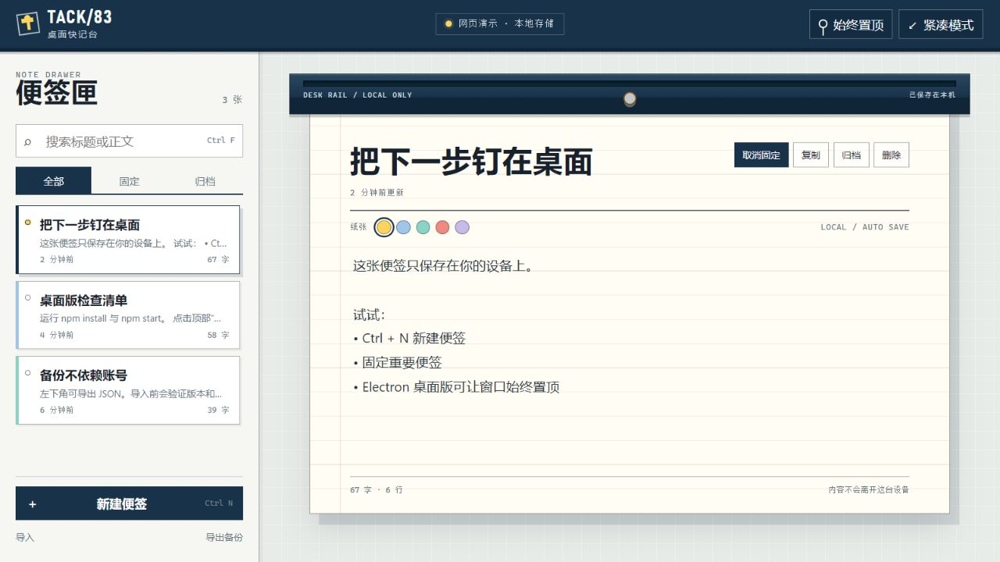

# TACK/83 · 桌面便签

一个本地优先的 Electron 桌面快记台：便签可搜索、固定、换色、归档和 JSON 备份，桌面窗口支持真实的始终置顶与紧凑模式。



## 在线演示

<https://jokerlixing.github.io/100apps/apps/083-desktop-notes/>

网页演示包含完整的便签管理和本地存储。受浏览器权限限制，“始终置顶”只展示状态；使用下方 Electron 桌面版才能真正控制系统窗口层级。

## 运行桌面版

需要 Node.js 22 或更高版本。

```bash
cd apps/083-desktop-notes
npm install
npm start
```

启动后点击顶部“始终置顶”，再切换到其他应用即可检查窗口是否保持在最前。点击“紧凑模式”会把窗口收成单张便签大小。

## 运行网页演示

在仓库根目录启动任意静态服务器，例如：

```bash
python -m http.server 8083
```

然后打开 <http://localhost:8083/apps/083-desktop-notes/>。

## 功能

- 便签新建、编辑、复制、永久删除与自动保存
- 标题/正文搜索，固定便签优先排序，归档与恢复
- 五种索引纸颜色、字数与行数统计、`Ctrl+N` / `Ctrl+F` 快捷键
- 带版本校验的 JSON 导入导出；无效备份不会覆盖现有数据
- Electron 原生始终置顶、紧凑窗口、单实例与窗口状态恢复
- GitHub Pages 网页演示与 Electron 桌面端共用同一个受测核心

## 隐私与安全

便签正文只写入当前浏览器或 Electron 的本地存储，不上传、不请求网络、不需要账号。Electron 页面启用 `contextIsolation`、禁用 `nodeIntegration` 并开启 sandbox；preload 只暴露三个白名单窗口操作。JSON 备份由用户主动导出，需自行保管。

## 测试

```bash
npm run test:all
```

测试覆盖便签创建更新、复制、搜索排序、归档筛选、备份边界和窗口状态归一化；`check` 同时检查全部 JavaScript 文件语法。

## 技术栈

Electron 44、原生 HTML/CSS/JavaScript、Node.js 内置测试运行器、localStorage。
