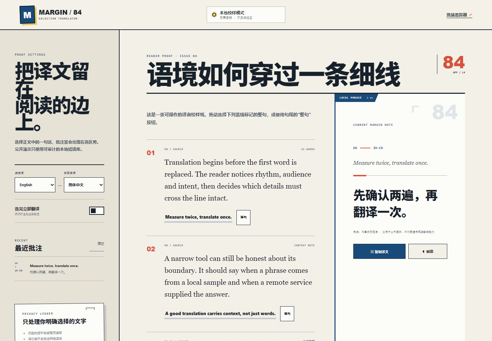
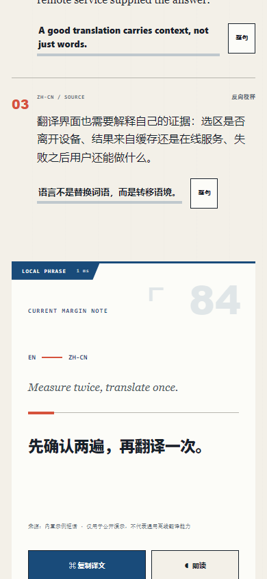

# MARGIN / 84 · 划词翻译插件

MARGIN / 84 是一个 Manifest V3 浏览器扩展：在网页中选择文字后，译文以“页边校样批注”的形式留在选区旁。项目同时提供一个无需安装、无需密钥的 GitHub Pages 演示，用来检查选区、语言方向、复制、朗读、历史与响应式界面。

在线演示：<https://jokerlixing.github.io/100apps/apps/084-selection-translator/>





## 核心功能

- 在普通网页中检测鼠标或键盘选区，并在选区附近显示可访问的翻译批注签
- 支持自动识别、英语、简体中文、日语、韩语、法语、西班牙语与德语方向
- 精确命中内置示例短语时完全本地处理；其余文本由扩展后台请求 MyMemory
- 500 字节输入边界、8 秒超时、响应格式校验、60 条有界缓存与 8 条去重历史
- 复制译文、浏览器语音朗读、自动翻译开关与全局暂停开关
- 网络、额度、响应异常和扩展更新均显示具体的恢复建议，不伪造离线结果
- 公开演示使用同一套 `translator-core.js`，但明确限制为 8 组本地短语

## 安装未打包扩展

1. 克隆或下载本仓库。
2. 在 Chrome/Edge 打开扩展管理页，并启用“开发者模式”。
3. 选择“加载已解压的扩展程序”。
4. 指向 `apps/084-selection-translator/` 目录。
5. 打开任意 `http` 或 `https` 页面，选择不超过 500 字节的文字，再点击选区旁的“翻译选区”。

扩展只申请：

- `storage`：保存设置、最近批注和有界缓存；
- `https://api.mymemory.translated.net/*`：只让后台服务工作线程访问唯一的翻译主机。

内容脚本不会扫描或上传整页正文，也不会在输入框、文本域或可编辑区域触发。没有分析埋点。

## 本地运行公开演示

```bash
node server.js
```

访问 <http://127.0.0.1:4084>。演示页不会调用在线翻译；请选择带蓝色下划线的一整句，或点击句尾“整句”按钮。

## 验证

在仓库根目录执行：

```bash
node --test apps/084-selection-translator/translator-core.test.js \
  apps/084-selection-translator/background.test.js \
  apps/084-selection-translator/manifest.test.js

node apps/084-selection-translator/qa/browser-smoke.mjs
node --test qa/tracker.test.js
```

浏览器烟测会启动本地服务器，在 Edge 中加载未打包扩展，验证真实鼠标选区到翻译卡的消息链，并重新生成桌面/移动截图。测试还会失败于页面错误、控制台错误、横向溢出、不可见键盘焦点、缺失服务工作线程或错误的翻译结果。

## 文件结构

```text
translator-core.js       共享验证、语言、短语、响应与历史合同
background.js            远程请求、超时、缓存、回退和消息入口
content.js / content.css 隔离页面中的选区批注 UI
popup.*                  设置、暂停状态与最近历史
manifest.json            Manifest V3 权限与运行时声明
index.html / demo.js     GitHub Pages 可检查演示
qa/browser-smoke.mjs     CDP 浏览器与扩展烟测
```

## 已知边界

- 公共演示不是通用离线翻译器，只包含 8 组可预测短语。
- MyMemory 免费服务有使用额度和可用性限制；额度或网络异常时，未知文本不会得到伪造结果。
- 本项目未发布到 Chrome Web Store；检查扩展本体需按上面的开发者模式步骤加载目录。

## 技术栈

原生 HTML / CSS / JavaScript、Chrome Manifest V3、`chrome.storage`、MyMemory REST API、Node.js built-in test runner、Chrome DevTools Protocol。
