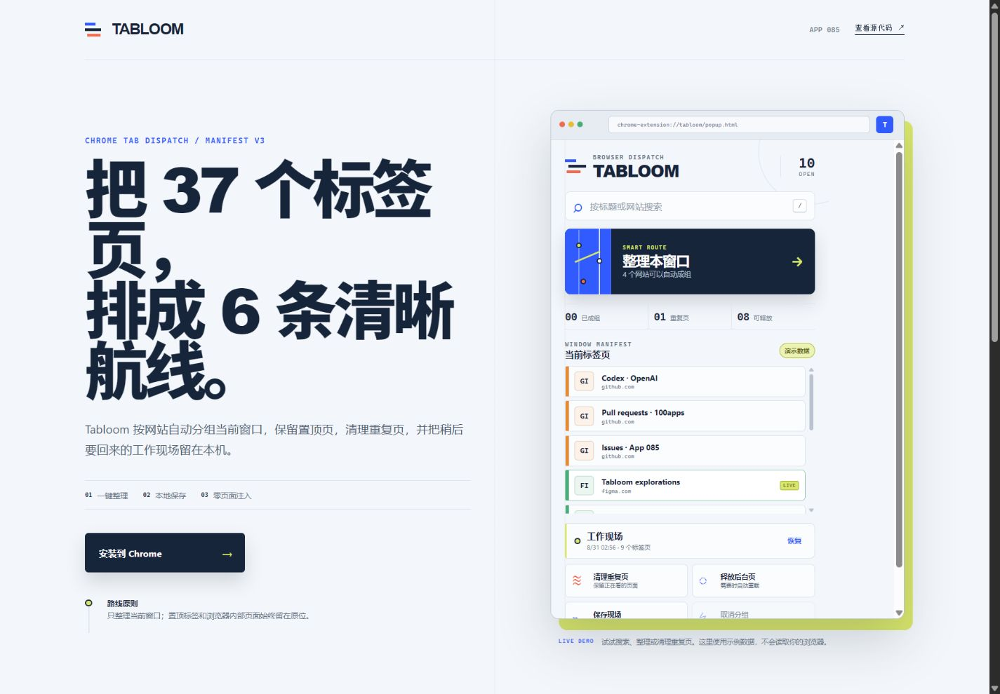

# Tabloom · 标签页调度台

Tabloom 是 100 Apps Challenge 的第 85 个项目：一个真正可加载到 Chrome 的 Manifest V3 标签页管理扩展。它把当前窗口里属于同一网站的标签页一键整理为原生分组，并提供搜索、重复页清理、后台页释放和本地工作现场恢复。

在线演示：<https://jokerlixing.github.io/100apps/apps/085-tab-manager/>



## 核心功能

- 按标准化域名为当前窗口创建 Chrome 原生标签组
- 自动保护置顶标签、浏览器内部页面和没有同站伙伴的单页
- 按标题或域名即时搜索并切换标签页
- 识别 URL 中的锚点与常见跟踪参数，安全清理重复页
- 释放非活动后台页内存，需要时由 Chrome 自动重载
- 把最近一次窗口快照保存到扩展本地存储，最多恢复 40 个标签页
- 同一套界面提供 GitHub Pages 交互演示，演示数据不会读取浏览器

## 安装到 Chrome

1. 克隆或下载本仓库。
2. 在 Chrome 打开 `chrome://extensions`。
3. 打开右上角“开发者模式”。
4. 点击“加载已解压的扩展程序”。
5. 选择 `apps/085-tab-manager` 目录。
6. 在工具栏扩展菜单中固定 **Tabloom**，然后点击图标使用。

建议使用 Chrome 102 或更高版本。项目使用 Manifest V3 和 Promise 形式的 Chrome API。

## 权限与隐私

| 权限 | 用途 |
| --- | --- |
| `tabs` | 读取当前窗口标签的标题和网址，并执行切换、关闭、分组、取消分组和释放 |
| `tabGroups` | 设置 Chrome 原生标签组的标题、颜色和折叠状态 |
| `storage` | 在本机扩展存储中保存最近一次窗口快照 |

Tabloom 不申请任何网站主机权限，不注入内容脚本，不读取页面正文，也不连接外部服务。保存的工作现场只进入 `chrome.storage.local`，卸载扩展时会随扩展数据一起清除。

## 本地开发与验证

项目不需要安装依赖。Node.js 20+ 可直接运行测试：

```bash
cd apps/085-tab-manager
npm test
```

也可以从仓库根目录运行：

```bash
node --test apps/085-tab-manager/tests/*.test.mjs
```

若要查看在线演示模式，从仓库根目录启动任意静态服务器，然后访问 `/apps/085-tab-manager/`。`popup.html?demo=1` 使用内存中的示例标签页；真实扩展的 `popup.html` 会自动连接 Chrome API。

## 目录结构

```text
085-tab-manager/
├── manifest.json       # Manifest V3 与最小权限
├── popup.html          # 扩展弹窗语义结构
├── popup.css           # 调度台视觉系统
├── popup.js            # Chrome 与演示适配器、交互状态
├── tab-domain.js       # 可独立测试的 URL/分组规则
├── index.html          # GitHub Pages 介绍与交互演示
├── demo.css            # 演示页样式
└── tests/              # 纯逻辑、manifest 与视觉证据
```

## 行为边界

- 一次只处理打开弹窗时所在的当前窗口。
- 已经属于某个标签组的标签不会被重新分组；可先点“取消分组”再重新整理。
- 置顶标签永远不会被自动分组、释放或作为重复页关闭。
- 工作现场恢复的是 URL、标题提示和置顶状态，不复原登录态、表单内容或历史后退栈。
- 出于误操作控制，单次恢复最多打开 40 个标签页。

## 技术栈

HTML、CSS、原生 JavaScript ES Modules、Chrome Extensions Manifest V3、`chrome.tabs`、`chrome.tabGroups`、`chrome.storage.local`、Node.js `node:test`。
