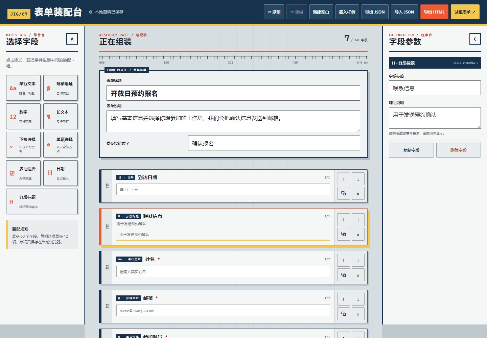

# JIG/87 · 表单装配台

一个零依赖、浏览器本地优先的低代码表单构建器。把字段像零件一样点击或拖入装配轨，在校准台修改标签与规则，试填通过后导出 JSON schema 或可独立运行的 HTML 表单。



## 核心功能

- 9 类零件：单行文本、邮箱、数字、长文本、下拉、单选、多选、日期和分段标题
- 点击添加、桌面拖入与拖拽重排；移动端提供上移/下移按钮
- 字段标签、说明、占位、必填、整行/半行、选项和数字边界编辑
- 复制、删除、撤销、重做和开放日样例
- 试填模式包含必填、邮箱、数字范围和多选校验，并生成本地回执
- localStorage 自动保存，损坏草稿会安全回退到内置样例
- JSON 导入/导出与安全的独立 HTML 导出
- 390px 移动端布局、键盘焦点和减少动画支持

## 运行

仓库根目录启动静态服务器：

```bash
python -m http.server 8087
```

打开：`http://127.0.0.1:8087/apps/087-low-code-form-builder/`

GitHub Pages：`https://jokerlixing.github.io/100apps/apps/087-low-code-form-builder/`

## 测试

```bash
node --test apps/087-low-code-form-builder/tests/model.test.js
node apps/087-low-code-form-builder/tests/static.test.js
node apps/087-low-code-form-builder/tests/browser-smoke.mjs
```

浏览器烟测需要本机安装 Chrome 或 Edge。它会启动临时浏览器配置、执行完整构建与试填流程，并生成桌面/移动端截图。

## 数据与隐私边界

- 草稿只写入当前浏览器的 `localStorage`，页面不加载第三方脚本、字体或接口。
- JSON 导入经过字段类型、长度、ID、选项数量和 schema 版本清洗。
- 独立 HTML 会转义标题、说明、标签和选项，不允许注入脚本。
- 预览和导出的 HTML 都只生成本地回执，不会收集或发送填写内容。

## 文件结构

- `index.html`：语义化装配台与试填对话框
- `styles.css`：工业夹具视觉、三栏与响应式布局
- `model.js`：schema、不可变字段操作、验证和导出
- `app.js`：拖放、状态历史、持久化、预览与下载
- `tests/`：模型、静态结构和浏览器烟测

## 当前限制

这是作品集级本地构建器，不包含账号、云端协作、真实提交端点、条件分支或分页表单。需要收集真实数据时，应把导出的 HTML 接入经过授权、具备隐私说明的后端。
