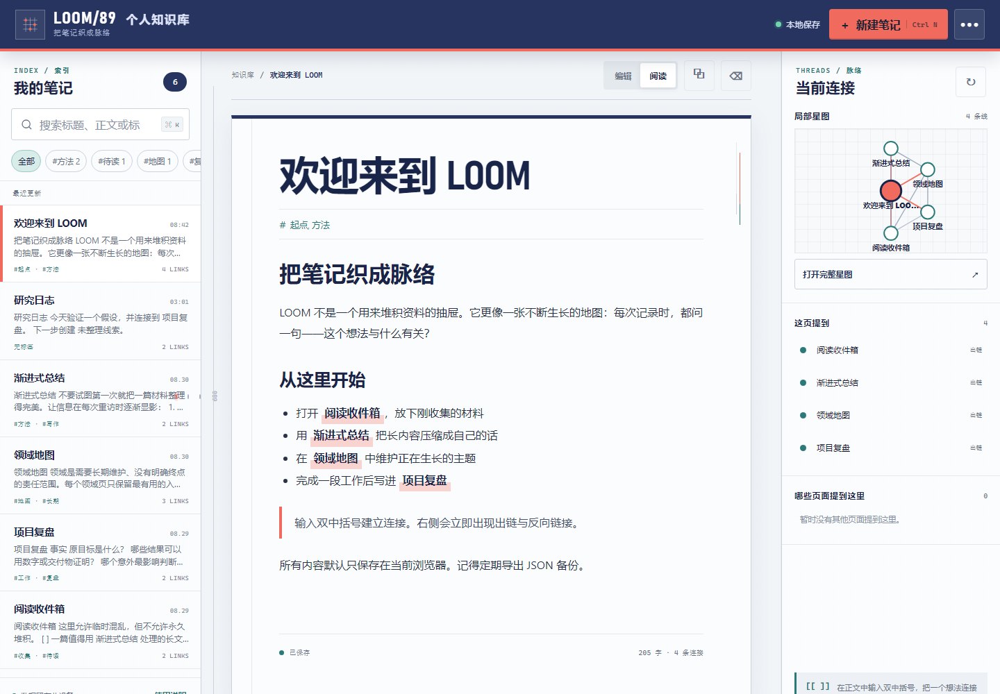

# LOOM/89 · 个人知识库 Wiki

LOOM/89 是一个本地优先的个人 Wiki：用 Markdown 写笔记，用 `[[双链]]` 建立关系，再从全文搜索、反向链接和关系星图中重新找到上下文。

在线体验：[https://jokerlixing.github.io/100apps/apps/089-knowledge-wiki/](https://jokerlixing.github.io/100apps/apps/089-knowledge-wiki/)



## 核心功能

- 本地笔记：新建、编辑、复制、删除、标签筛选与自动保存
- 双链导航：输入 `[[笔记标题]]` 获得候选提示；已存在页面直接跳转，未存在页面一键创建
- 链路维护：标题重命名时同步更新其他笔记中的精确双链
- 全文搜索：同时检索标题、正文与标签，并优先展示标题命中
- 反向链接：查看“这页提到什么”以及“哪些页面提到这里”
- 关系星图：可点击的局部图和全库 SVG 图，明确区分当前、已有和待创建节点
- 安全预览：支持标题、列表、引用、代码、粗体、斜体和安全网页链接；用户 HTML 会被转义
- 可迁移数据：完整 JSON 备份导入/导出，以及当前笔记 Markdown 导出
- 键盘操作：`Ctrl/Cmd+K` 搜索、`Ctrl/Cmd+N` 新建、`Ctrl/Cmd+S` 立即保存

## 隐私与数据边界

笔记只写入当前浏览器的 `localStorage`，不会上传到服务器。清除该站点的浏览器数据会删除本地知识库，因此请定期从右上角菜单导出 JSON 备份。导入时会先校验版本、笔记结构、重复 ID 和重复标题；错误文件不会覆盖现有数据。

## 本地运行

在仓库根目录启动任意静态服务器，例如：

```bash
python -m http.server 8000
```

然后访问：

```text
http://localhost:8000/apps/089-knowledge-wiki/
```

不要直接用 `file://` 打开页面，因为部分浏览器会限制本地存储或下载能力。

## 测试

核心逻辑与页面契约：

```bash
node --test apps/089-knowledge-wiki/knowledge-core.test.js apps/089-knowledge-wiki/ui.test.js
```

真实浏览器烟雾测试（自动寻找已安装的 Chrome 或 Edge，并更新两张截图）：

```bash
node apps/089-knowledge-wiki/qa/browser-smoke.mjs
```

浏览器流程覆盖首次示例、新建与编辑、双链跳转、全文搜索、完整星图、刷新持久化、键盘焦点和 390px 手机布局。

## 技术实现

- HTML5 + CSS + 原生 JavaScript，无远程运行时依赖
- `knowledge-core.js`：可在 Node 和浏览器共用的纯函数领域层
- SVG：可访问、可点击的确定性关系图布局
- `localStorage`：版本化本地存储与 JSON 备份
- Node.js 内置测试运行器 + Chrome DevTools Protocol 浏览器验收

## 首版范围

LOOM/89 是单设备、单用户知识库，不提供账号、云同步或多人协作。这个边界让 GitHub Pages 演示具备完整核心流程，也让私人笔记默认不离开设备。

### 手机布局


