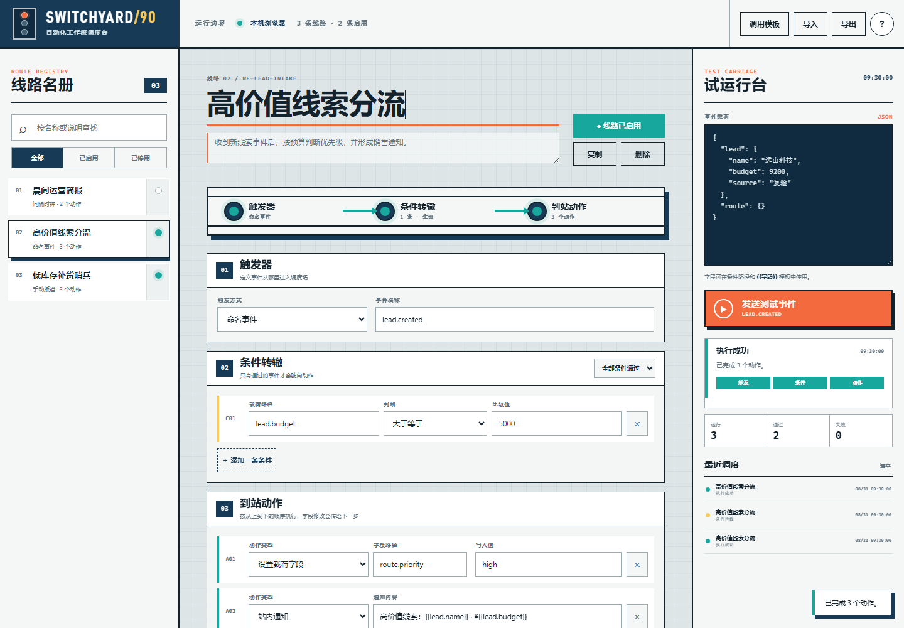

# SWITCHYARD/90 · 自动化工作流调度台

SWITCHYARD/90 是 100 Apps Challenge 的第 90 个项目：一个可直接在浏览器使用的本地优先自动化工作流引擎。它把一条自动化拆成触发器、条件和动作，让你用 JSON 事件立即试跑、查看每一步结果、保存运行记录，并通过 JSON 备份交换配置。

## 在线体验

[打开 GitHub Pages](https://jokerlixing.github.io/100apps/apps/090-workflow-engine/)



## 核心功能

- 手动、命名事件和页面内间隔触发器
- 全部 / 任一条件组合，以及数值、文本、集合和存在性判断
- 站内通知、调度日志、设置载荷字段和 Webhook 请求预览
- 后续动作可读取前一步设置的字段，支持 `{{path.to.value}}` 模板
- 三套可复制模板、线路搜索与启停、复制和删除
- 版本化 `localStorage` 持久化、运行统计、最近 60 条调度记录
- JSON 导入导出与损坏备份防护
- 1440px 桌面调度台和 390px 移动布局，键盘焦点与减少动态效果支持

## 运行边界

这是无需账号和服务端的 GitHub Pages 版本。工作流、载荷与历史只保存在当前浏览器；间隔触发器仅在页面打开时运行。Webhook 动作会校验地址并展示请求预览，但不会自动把数据发送给第三方。需要 24 小时常驻调度、密钥托管或接收入站 Webhook 时，应在此纯函数内核之上增加经过鉴权的服务端执行器。

## 本地运行

在仓库根目录启动任意静态服务器，例如：

```powershell
python -m http.server 8080
```

然后访问 `http://localhost:8080/apps/090-workflow-engine/`。

## 验证

```powershell
node --test apps/090-workflow-engine/workflow-core.test.js
node --check apps/090-workflow-engine/workflow-core.js
node --check apps/090-workflow-engine/app.js
node apps/090-workflow-engine/qa/browser-smoke.mjs
```

浏览器烟雾测试会使用本机 Chrome 或 Edge 的临时配置，验证成功 / 拦截运行、新建与启用、刷新持久化、备份下载、桌面和移动端无横向溢出，并生成 `assets/screenshot-desktop.png` 与 `assets/screenshot-mobile.png`。

## 技术栈

Semantic HTML、CSS、原生 JavaScript、Node.js 内置测试运行器、Chromium DevTools Protocol。项目不依赖前端框架或第三方 CDN。

