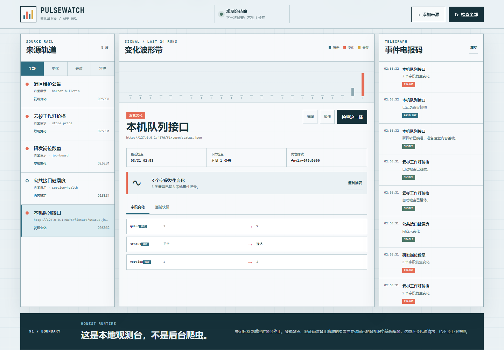

# PULSEWATCH/91 · 变化监测台

100 个应用挑战的第 91 个项目。PULSEWATCH/91 是一张运行在浏览器里的“采集观测站”：给公开 JSON、纯文本接口或内置演示源接上探针，按间隔检查内容指纹，把字段差异、采集时间和失败原因留在本机。



## 功能

- 四路无需网络的演示来源：维护公告、商品价格、岗位数量与接口健康度
- 真实 CORS JSON/文本 URL，10 秒超时、200 KB 响应上限和明确错误提示
- 可选 JSON 点路径，例如 `data.items.0.price`，只监测响应中的目标字段
- 稳定键序列化与 FNV-1a 内容指纹，字段级 JSON 差异和行级文本差异
- 手动检查单路/全部来源；页面打开期间每 15 秒扫描到期任务
- 每路最多 24 个采集点、全局最多 80 条事件，失败不会覆盖上次成功快照
- 暂停/继续、来源编辑删除、全部/变化/失败/暂停筛选
- 浏览器本地通知、变化摘要复制、JSON 导出与校验导入
- `localStorage` 刷新恢复、演示数据一键复位
- 1440px 桌面与 390px 手机响应式布局、可见焦点和 reduced-motion 支持

## 运行

从仓库根目录启动任意静态服务器：

```powershell
python -m http.server 4173 --bind 127.0.0.1
```

访问：

```text
http://127.0.0.1:4173/apps/091-crawler-dashboard/
```

GitHub Pages 地址：

```text
https://jokerlixing.github.io/100apps/apps/091-crawler-dashboard/
```

首次打开已有四路演示基线。点击“检查全部”会得到三路变化和一路稳定结果，适合快速验收完整差异流程。

## 添加真实来源

“添加来源”支持无需登录、允许浏览器跨域访问的 `http`/`https` 地址：

- JSON：响应必须是有效 JSON；点路径留空时监测完整响应。
- 纯文本：按行比较新增与移除内容。
- 最短间隔为 1 分钟，最长为 1 天。
- 浏览器通知需要用户主动授权，且只在页面运行时发送。

如果控制台能请求到地址、页面却提示“网络或跨域请求失败”，请检查来源是否返回正确的 `Access-Control-Allow-Origin`。登录页、验证码、反爬页面和需要私密请求头的接口不适合直接接入此静态版本。

## 真实边界、安全与隐私

- 这是静态作品集应用，不是云端调度器。标签页关闭、设备休眠或浏览器节流时，定时检查会停止。
- 页面不会代理请求，不会绕过站点登录、验证码、访问控制或 robots/服务条款。
- 不要把 API 密钥、账号密码或私密令牌放进 URL；浏览器会直接访问你填写的地址。
- `fetch` 使用 `credentials: "omit"`，不会主动携带目标站点 Cookie。
- 快照、来源和事件只保存在当前浏览器 `localStorage`。导出的 JSON 可能含目标数据，应按原数据敏感级别保管。
- 远程内容通过文本节点或 `<pre>` 显示，不作为 HTML 执行；导入只接受 schemaVersion 1，并限制来源、事件和快照规模。
- 内容指纹用于快速判断变化，不是密码学哈希，也不适合签名或防篡改场景。

需要真正的 7×24 抓取、登录会话、服务端密钥、代理网络、持久队列或团队推送时，应另建合规后端，并为目标域名设置白名单、速率限制、SSRF 防护、密钥管理和审计日志。

## 测试

从仓库根目录执行：

```powershell
node --test apps/091-crawler-dashboard/monitor-core.test.js qa/tracker.test.js
node --check apps/091-crawler-dashboard/monitor-core.js
node --check apps/091-crawler-dashboard/app.js
node apps/091-crawler-dashboard/qa/browser-smoke.mjs
```

领域测试覆盖来源校验、点路径提取、规范化指纹、JSON/文本差异、调度和导入上限。浏览器验收会启动一个本机 JSON 夹具，验证首次基线、二次字段变化、暂停与刷新恢复、导出数据、桌面/手机布局、焦点状态和运行时错误，并重建 `assets` 下的两张截图。

## 技术栈

- 语义化 HTML、原生 CSS、原生 JavaScript
- 零依赖 UMD 领域核心
- Fetch、AbortController、Notification、localStorage、原生 `<dialog>`
- Node `node:test` 与 Chrome DevTools Protocol 浏览器验收
