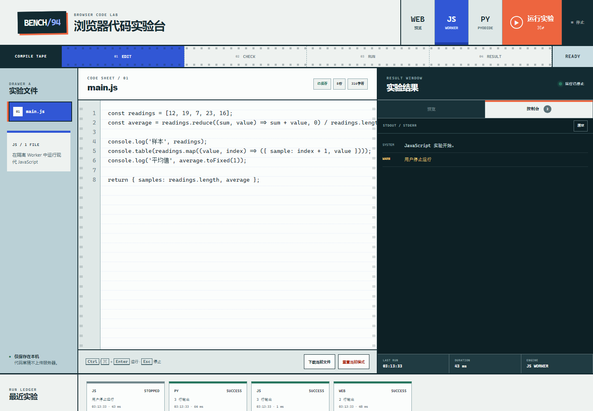

# BENCH/94 · 浏览器代码实验台

100 个应用挑战的第 94 个项目。BENCH/94 是一个可直接部署到 GitHub Pages 的在线 IDE：在一个教学机实验台界面里编辑 Web、JavaScript 或 Python，运行后查看隔离预览、标准输出、错误和最近实验记录。



## 功能

- Web 模式包含 `index.html`、`styles.css`、`script.js` 三个文件，组装后放进 sandboxed iframe 预览
- Web 预览 CSP 禁止网络连接、外部脚本、表单提交和顶层导航，console 与运行错误回传到实验台
- JavaScript 在独立 Web Worker 中执行，没有主页面 DOM，并关闭网络与子 Worker 能力
- Python 通过模块 Worker 按需加载 Pyodide `v314.0.6`，支持 stdout、stderr、最后表达式和运行错误
- 运行可以停止；JavaScript/Python 真正执行阶段超过 8 秒会被终止，Python 首次加载单独保留 30 秒
- `Ctrl/⌘ + Enter` 运行、Escape 停止、Tab 插入两个空格
- Web 三文件、JavaScript 与 Python 草稿按模式保存在 localStorage
- 当前文件可下载；当前模式可恢复官方模板，不影响其他模式与运行记录
- 编译纸带展示 EDIT、CHECK、RUN、RESULT 真实阶段
- 1440px 桌面与 390px 手机响应式布局、可见键盘焦点和 reduced-motion 支持

## 运行

项目没有构建步骤，也没有 npm 依赖。从仓库根目录启动静态服务器：

```powershell
python -m http.server 4173 --bind 127.0.0.1
```

访问：

```text
http://127.0.0.1:4173/apps/094-online-ide/
```

部署入口：

```text
https://jokerlixing.github.io/100apps/apps/094-online-ide/
```

Worker 与模块 Worker 在 `file://` 下会受到浏览器安全策略限制，因此请使用 HTTP 静态服务器或 GitHub Pages，不要直接双击 `index.html` 验收。

## 运行边界

- 所有代码草稿只写入当前浏览器的 localStorage，不上传到 BENCH/94 服务器。
- Web 预览使用 `sandbox="allow-scripts"`，不授予同源权限；预览不能读取主页面或其 localStorage。
- Web 预览允许 `data:`、`blob:` 和 HTTPS 图片/媒体用于演示，但 `connect-src` 为 `none`，用户脚本不能发起 Fetch/XHR。
- JavaScript Worker 与主页面没有共享 DOM；停止和超时通过终止整个 Worker 生效。
- Python 运行时来自固定版本 `https://cdn.jsdelivr.net/pyodide/v314.0.6/full/`。首次运行需要联网下载 WebAssembly 资源，浏览器缓存后通常更快。
- 终止 Python 会回收当前解释器；下一次运行会重建 Worker。浏览器可能复用已下载的 CDN 缓存。
- 这是作品集与学习用途的客户端实验台，不是面向不受信任租户的服务器沙箱，也不提供 npm/pip 包管理、文件系统、终端或账号同步。

## 测试

从仓库根目录执行：

```powershell
node --test apps/094-online-ide/ide-core.test.js
node --check apps/094-online-ide/ide-core.js
node --check apps/094-online-ide/app.js
node --check apps/094-online-ide/js-worker.js
node --check apps/094-online-ide/python-worker.mjs
node apps/094-online-ide/qa/browser-smoke.mjs
```

核心测试覆盖三种模式与文件元数据、模板隔离、模式/文件回退、代码统计、行号、循环对象 console 序列化、运行历史清洗和损坏缓存迁移。浏览器验收会真实运行 Web iframe 与 JavaScript Worker，并用确定性的 Python Worker 替身验证加载、输出和结果 UI；它还覆盖停止、重置、持久化、桌面/手机布局、焦点与运行时错误，并输出两张截图到 `assets/`。

## 技术栈

- 语义化 HTML、原生 CSS、原生 JavaScript
- sandboxed iframe `srcdoc` 与内容安全策略
- Web Workers 与 Pyodide `v314.0.6`
- localStorage 与零依赖 UMD 领域核心
- `node:test` 与 Chrome DevTools Protocol 浏览器验收

