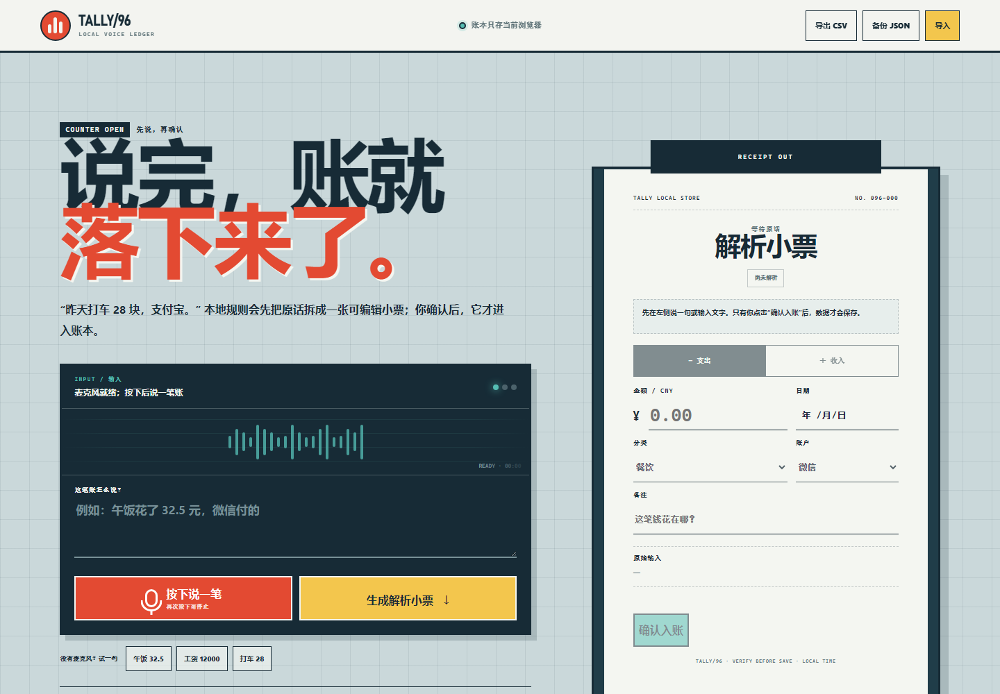

# TALLY/96 · 语音记账

100 个应用挑战的第 96 个项目。TALLY/96 把一句中文口语变成一张可编辑的记账小票：先说或键入，核对金额、收支、分类、账户与日期，再确认入账。账本、统计和备份都在浏览器本地完成；没有麦克风也能使用全部核心功能。



## 功能

- Chrome/Edge 浏览器语音输入，权限拒绝或不支持时完整降级到键盘输入
- 本地解析阿拉伯数字与常见中文金额，例如“三十二块五”“一万两千元”
- 识别收入/支出、11 类账目、微信/支付宝/现金/银行卡和相对/具体日期
- 展示识别字段、置信提示与可操作警告；金额缺失时拒绝猜测和保存
- 可编辑“解析小票”，保存后支持再次编辑和删除
- 当月收入、支出、结余、笔数以及支出分类占比
- 按月份、收支、分类和关键字组合筛选
- CSV 导出带公式注入防护，JSON 备份支持校验、去重与合并导入
- 首次打开提供 5 条明确标注的演示账目，可恢复演示或清空重来
- localStorage 损坏自动恢复，最多保存 500 条经过校验的记录
- 1440px 桌面到 390px 手机响应式布局、44px 触控目标、键盘焦点与 reduced-motion 支持

## 本地运行

项目是零依赖静态应用。从仓库根目录启动静态服务器：

```powershell
python -m http.server 4173 --bind 127.0.0.1
```

访问：

```text
http://127.0.0.1:4173/apps/096-voice-bookkeeping/
```

GitHub Pages 地址：

```text
https://jokerlixing.github.io/100apps/apps/096-voice-bookkeeping/
```

## 解析边界

TALLY/96 使用本地、确定性的关键词和金额规则，不调用大模型，也不会把规则匹配包装成 AI。它适合“昨天打车 28 块，支付宝”这类简短语句；复杂拆账、多币种、多人分摊和模糊上下文需要人工修正或拆成多笔。

浏览器语音识别可能把音频发送到浏览器提供商的服务，具体取决于浏览器与系统。TALLY 不保存音频；最终转写文本仅在用户点击“确认入账”后随账目进入 localStorage。若不希望使用语音服务，直接键入即可。

## 隐私与数据安全

- 账目、演示状态和设置只保存在当前浏览器，不含账号或云端同步。
- 页面没有 API Key、分析脚本或第三方数据接口。
- 解析失败不会产生账目；金额必须由规则识别或用户明确填写。
- 导出的 CSV 会在 `= + - @` 开头的文本前加安全前缀，降低表格公式注入风险。
- JSON 导入限制大小、条数、字段枚举、金额和日期，并拒绝重复 ID。
- 清空操作不可撤销，页面会先要求确认；重要数据请先导出 JSON 备份。

## 测试

从仓库根目录执行：

```powershell
node --test apps/096-voice-bookkeeping/bookkeeping-core.test.js qa/tracker.test.js
node --check apps/096-voice-bookkeeping/bookkeeping-core.js
node --check apps/096-voice-bookkeeping/storage.js
node --check apps/096-voice-bookkeeping/app.js
node apps/096-voice-bookkeeping/qa/browser-smoke.mjs
```

领域测试覆盖中文金额、收支、分类、账户、日期、记录校验、月度汇总、组合筛选、CSV 安全、备份导入和损坏缓存。浏览器冒烟测试走完解析、人工校对、保存、编辑、删除、筛选、刷新恢复与下载，并检查桌面/手机布局、触控尺寸、键盘焦点和运行时异常。

## 技术栈

- 语义化 HTML、原生 CSS、原生 JavaScript
- 零依赖 UMD 领域核心与版本化 localStorage 适配器
- Web Speech API：`SpeechRecognition` / `webkitSpeechRecognition`
- Blob、URL、File API 与 Intl.NumberFormat
- Node.js `node:test` 与 Chrome DevTools Protocol 浏览器验收

## 快捷操作

- `Ctrl/⌘ + Enter`：解析当前输入
- “午饭 32.5 / 工资 12000 / 打车 28”：无麦克风时载入示例并直接解析
- “备份 JSON”：保存可重新导入的完整账本
- 手机顶部“导入”：选择 TALLY/96 JSON 备份
