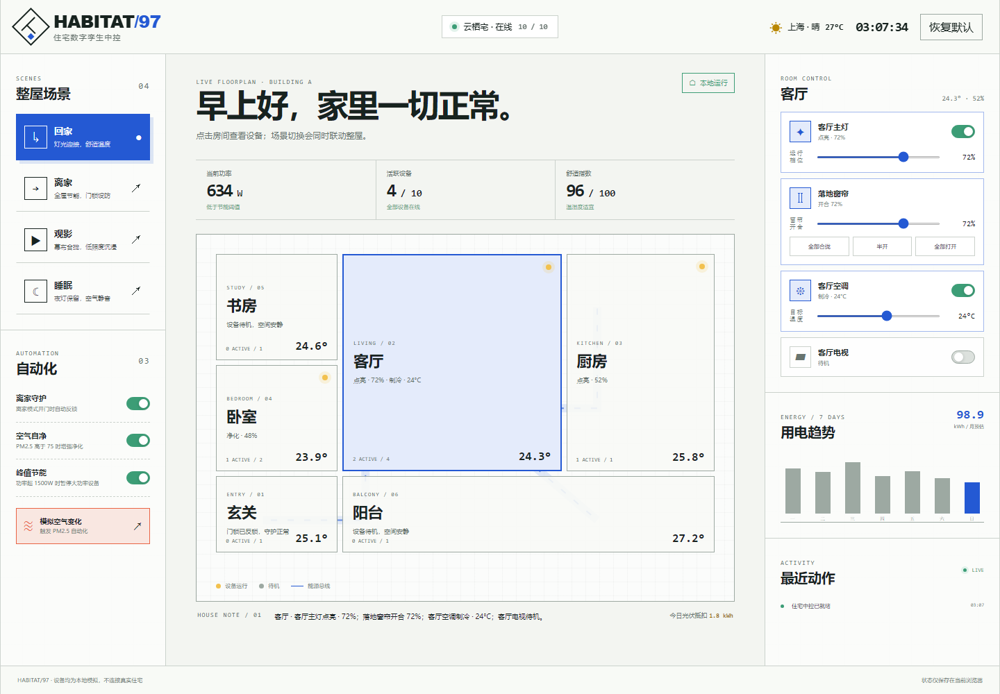
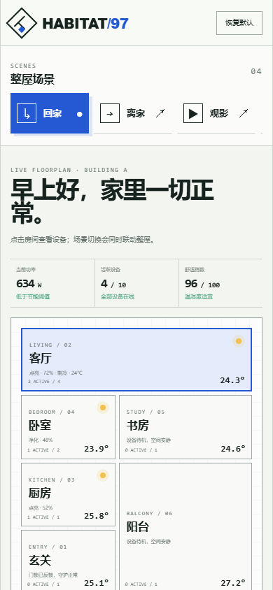

# HABITAT/97 · 智能家居中控

HABITAT/97 是 100 Apps Challenge 的第 97 个项目：一个零依赖、可直接部署到 GitHub Pages 的住宅数字孪生中控。它用交互户型连接房间、设备、场景、自动化和能耗反馈，让“整屋联动”不只是一排开关。

## 在线访问

`https://jokerlixing.github.io/100apps/apps/097-smart-home-control/`

本地可在仓库根目录运行：

```powershell
python -m http.server 4197
```

然后打开 `http://127.0.0.1:4197/apps/097-smart-home-control/`。应用没有构建步骤，也不依赖第三方 CDN。

## 核心功能

- 6 个空间组成的交互户型，实时呈现房间温度、活跃设备和代表状态。
- 10 台模拟设备，覆盖灯光、空调、窗帘、电视、净化器、门锁和家电。
- 回家、离家、观影、睡眠 4 个场景，一次操作联动全屋设备。
- 离家守护、空气自净、峰值节能 3 条可开关自动化；“模拟空气变化”可直接验收规则触发。
- 当前功率、活跃设备、舒适指数、月度用电预估和最近 7 日趋势。
- 最近动作记录、刷新持久化、恢复默认和完整窄屏布局。

## 模拟与隐私边界

- 所有设备、天气、温湿度、空气质量、功率和光伏数据均为产品演示数据，不代表真实住宅状态。
- 应用不会搜索局域网、连接智能硬件、调用厂商 API、上传数据或发送通知。
- 状态只写入当前站点的 `localStorage`。清理站点数据、使用无痕模式或更换浏览器会失去这些状态。
- 功率和月度用电是根据模拟设备额定功率计算的近似值，不应用于电费结算。

## 键盘与无障碍

- `Tab` 可遍历场景、房间、设备开关、滑杆、自动化和恢复操作。
- 场景、房间和开关状态使用 `aria-pressed` / `role="switch"` 表达。
- 操作结果通过 `aria-live` 提示；范围控件有明确设备标签。
- 页面提供跳转到主内容的入口、可见焦点环，并在 `prefers-reduced-motion` 下关闭联动轨迹动画。

## 验证

```powershell
node --test apps/097-smart-home-control/smart-home-core.test.js
node --check apps/097-smart-home-control/smart-home-core.js
node --check apps/097-smart-home-control/app.js
node apps/097-smart-home-control/qa/browser-smoke.mjs
node --test qa/tracker.test.js
```

浏览器冒烟测试使用临时 Chrome / Edge 用户目录，覆盖场景联动、房间筛选、设备单控、滑杆、刷新持久化、空气自动化、恢复默认、桌面/移动布局和运行时错误，并生成两张验收截图到 `assets/`。

## 验收截图

### 桌面端



### 移动端


