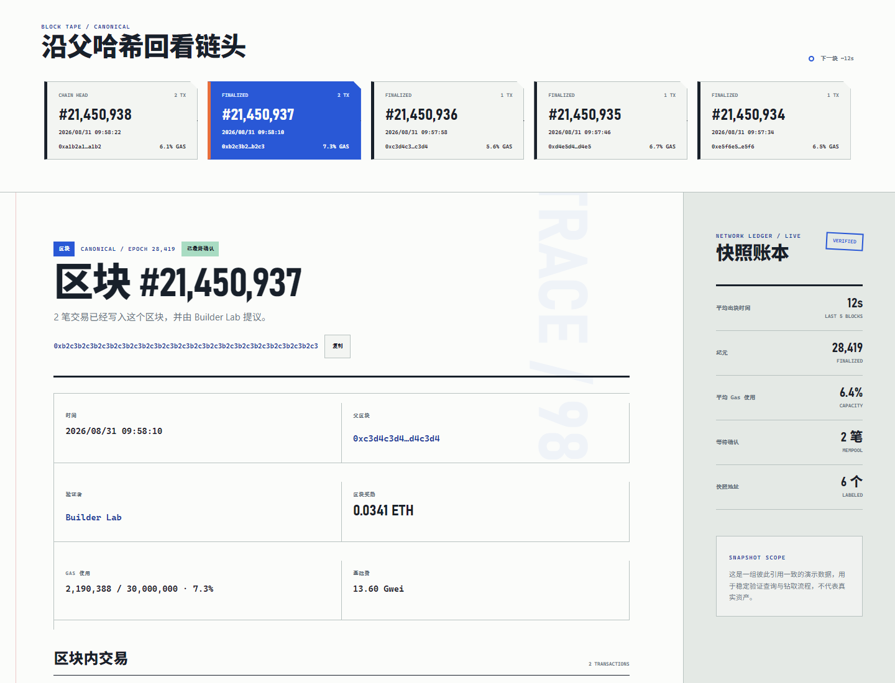
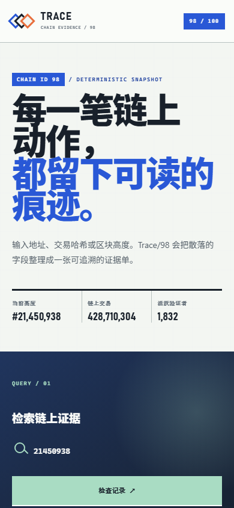

# Trace/98 · 区块链浏览器

Trace/98 是 100 Apps Challenge 的第 98 个项目。它把地址、交易和区块放进同一张可追溯的本地链快照里：输入任意一种链上标识，即可查看状态、金额、Gas、验证者、父区块和关联活动，并继续钻取上下游记录。



## 核心体验

- 通用搜索自动识别十进制区块高度、40 位地址和 64 位交易哈希。
- 地址证据单汇总余额、账户类型、收发次数、净流量和相关交易。
- 交易证据单展示成功、失败、待确认三种状态，以及资金路径、费用、方法和输入数据。
- 区块证据单连接父区块、验证者、Gas 使用率、奖励和区块内交易。
- 可点击的区块带、最近交易账本、URL `?q=` 分享与浏览器前进/后退均可用。
- 对格式错误和快照外记录分别提供明确的 400 / 404 引导。
- 所有数据均为互相引用一致的本地演示快照，不连接钱包、不上传查询内容。

## 示例查询

```text
区块：21450938
地址：0x7a90e11f8af292abe1072779f89cdd021da35aa4
交易：0x9f1c9f1c9f1c9f1c9f1c9f1c9f1c9f1c9f1c9f1c9f1c9f1c9f1c9f1c9f1c9f1c9f1c
```

也可以直接使用搜索框下方的“示例地址 / 示例交易 / 最新区块”。

## 本地运行

这是一个零依赖静态应用。可以直接打开 `index.html`，或在项目目录启动任意静态服务器：

```powershell
python -m http.server 8098
```

随后访问 `http://127.0.0.1:8098/apps/098-blockchain-explorer/`。

## 验证

```powershell
node --test apps/098-blockchain-explorer/explorer-core.test.js
node apps/098-blockchain-explorer/qa/browser-smoke.mjs
```

核心测试覆盖查询分类、格式化、实体查找、地址活动聚合、错误码和快照引用完整性。浏览器冒烟测试使用本机 Chrome / Edge 验证三类查询、错误态、URL 状态、键盘焦点、桌面与移动端无横向溢出、触控尺寸以及运行时错误，并生成截图。



## 技术栈与边界

- Semantic HTML、现代 CSS、Vanilla JavaScript
- Node.js 内置 `node:test`
- Chrome DevTools Protocol 浏览器验证
- GitHub Pages 静态部署

当前版本刻意采用确定性的本地快照，以保证 GitHub Pages 上的查询流程稳定且无需 API 密钥。`explorer-core.js` 与视图层解耦，未来可将 `chain-data.js` 替换为真实 RPC / 索引器适配器。
