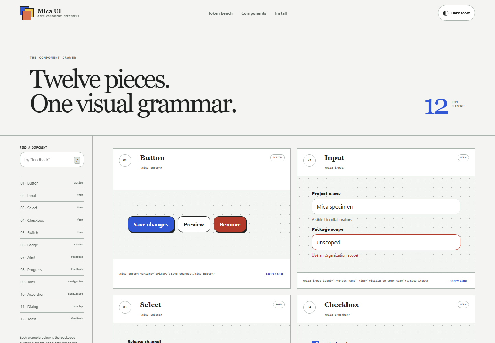

# Mica UI

Mica UI is app 099 in the 100 Apps Challenge: a dependency-free component library built with browser-native custom elements. Its live specimen site lets developers search, exercise, restyle, and copy twelve accessible components without a framework or build step.



## Components

| Element | Purpose |
| --- | --- |
| `mica-button` | Primary, quiet, and destructive actions |
| `mica-input` | Labeled text input with hint and error states |
| `mica-select` | Native selection from declarative options |
| `mica-checkbox` | Independent form choice |
| `mica-switch` | Immediate on/off setting |
| `mica-badge` | Neutral, positive, warning, and critical status |
| `mica-alert` | Persistent feedback with optional dismissal |
| `mica-progress` | Determinate, clamped progress |
| `mica-tabs` | Keyboard-operable tab panels |
| `mica-accordion` | Native disclosure section |
| `mica-dialog` | Native modal dialog with focus management |
| `mica-toast` | Polite live-region notification |

## Run the documentation site

Serve the repository root so relative package assets and GitHub Pages paths behave the same way:

```powershell
python -m http.server 4173
```

Then open `http://localhost:4173/apps/099-mica-ui/`.

## Package usage

The project is prepared as `@hundred-apps/mica-ui@1.0.0`. Public registry publication is deliberately left to the repository owner; the package contents are verified locally with npm's dry-run.

```bash
npm install @hundred-apps/mica-ui
```

```html
<link rel="stylesheet" href="./node_modules/@hundred-apps/mica-ui/mica-ui.css">
<script src="./node_modules/@hundred-apps/mica-ui/mica-ui.js"></script>

<mica-alert tone="positive" title="Ready">
  Your interface has a material system.
</mica-alert>
```

The library exposes four inheritable tokens: `--mica-accent`, `--mica-radius`, `--mica-scale`, and the light/dark values selected by `data-mica-theme`.

## Events and methods

- Form controls emit composed `mica-input` or `mica-change` events.
- Tabs emit `mica-change`; accordions emit `mica-toggle`.
- Alerts emit `mica-dismiss` when dismissed.
- Dialogs expose `show()` and `close()` and emit `mica-open` / `mica-close`.
- Toasts expose `show(message, tone)` and use a polite live region.

## Verify

```powershell
node --test component-core.test.js
npm pack --dry-run
node qa/browser-smoke.mjs
```

The catalog tests cover component completeness, search, token repair, progress bounds, and snippets. The browser smoke check covers registration, search, token controls, tabs, dialogs, and toast feedback.

## Stack

- HTML, CSS, and JavaScript
- Custom Elements and Shadow DOM
- Native dialog, details, form controls, and ARIA semantics
- Node.js built-in tests and npm package tooling
- MIT license
