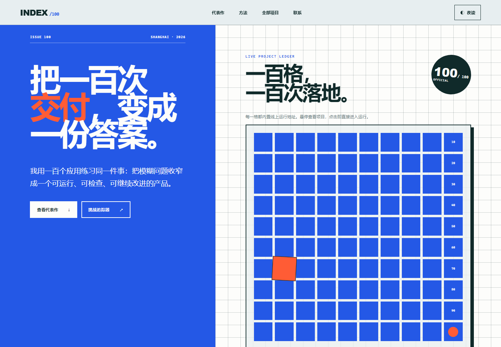

# INDEX/100 · 个人作品集网站

100 Apps Challenge 的第 100 个项目，也是这次挑战的收官入口。INDEX/100 把一百个应用整理成一份可浏览的作品档案：访问者可以从 10×10 项目索引、代表作和完整档案三个层次理解挑战，并直接打开已有部署链接。



## 核心功能

- 构建时从根追踪器同步完整 100 项目录，首屏无需等待网络请求即可运行
- 10×10 项目打孔索引内置 100 个唯一部署地址，可悬停预览并点击直接运行
- 按项目名称、说明、编号、难度和完成状态组合筛选
- 项目详情弹窗展示难度、状态、说明和公开访问入口
- 下载当前作品清单为 JSON，方便备份或二次整理
- 明暗阅读模式保存在浏览器本地
- 后台核对根追踪器；请求超时或失败时继续使用内置的 100 项完整目录
- 适配键盘、减少动态效果偏好、桌面与移动端布局

## 数据与隐私

页面先读取随 App 100 发布的静态目录，再在后台请求同一 GitHub Pages 站点下的根 `index.html`，通过纯文本解析核对 `IDEAS` 和 `INIT_DONE`。解析过程不会执行追踪器中的 JavaScript，只接受 `http` / `https` 项目链接。除阅读模式外不保存个人数据，也不调用第三方 API。

## 本地运行

从仓库根目录启动任意静态服务器，例如：

```powershell
python -m http.server 8000
```

然后访问：

```text
http://127.0.0.1:8000/apps/100-portfolio/
```

直接双击 `index.html` 时，后台追踪器核对可能会被浏览器阻止，但内置 100 项目录仍会立即显示。建议使用静态服务器检查完整行为。

## 验证

```powershell
node --test apps/100-portfolio/portfolio-core.test.js
node --test apps/100-portfolio/catalog-sync.test.js
node apps/100-portfolio/qa/browser-smoke.mjs
```

根追踪器内容变更后，先同步 App 100 的静态目录：

```powershell
node apps/100-portfolio/qa/sync-project-catalog.mjs
```

浏览器验收会检查内置目录即时渲染、真实追踪器后台核对、100 个唯一运行链接、项目选择、组合筛选、详情弹窗、JSON 导出、焦点样式、移动端 44px 触控格、页面溢出和运行时错误，并更新以下视觉证据：

- `assets/screenshot-desktop.png`
- `assets/screenshot-archive.png`
- `assets/screenshot-mobile.png`

## 技术栈

- Semantic HTML
- Modern CSS（Grid、custom properties、`color-mix()`、原生 `dialog`）
- Vanilla JavaScript
- Node.js test runner
- Chrome DevTools Protocol 浏览器验收

## 部署地址

https://jokerlixing.github.io/100apps/apps/100-portfolio/
